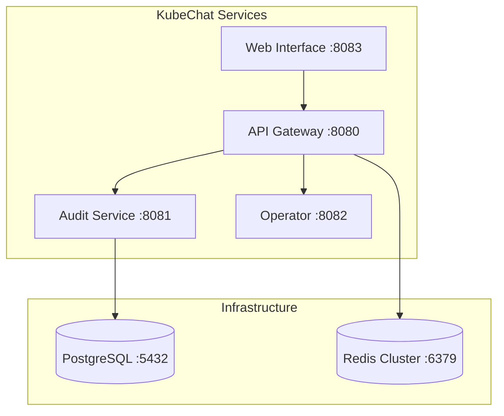

# KubeChat Development Environment Guide

**Version**: 1.0  
**Last Updated**: September 8, 2025  
**Environment**: Development (Rancher Desktop)  
**Status**: ✅ OPERATIONAL

---

## 📋 Table of Contents

1. [Environment Overview](#environment-overview)
2. [Architecture & Components](#architecture--components)
3. [Current Deployment Status](#current-deployment-status)
4. [Development Workflow](#development-workflow)
5. [Local Access URLs](#local-access-urls)
6. [Testing Procedures](#testing-procedures)
7. [Story Development Workflow](#story-development-workflow)
8. [QA Validation Guide](#qa-validation-guide)
9. [Troubleshooting](#troubleshooting)
10. [Reference Commands](#reference-commands)

---

## 🏗️ Environment Overview

KubeChat development environment is running on **Rancher Desktop** with a complete microservices architecture deployed using **Helm charts**. All services are containerized and running in the `kubechat-system` namespace.

### **Key Technologies:**
- **Container Platform**: Rancher Desktop (Kubernetes)
- **Deployment**: Helm 3.x
- **Container Registry**: Local registry (localhost:5001)
- **Database**: PostgreSQL (persistent)
- **Cache**: Redis Cluster
- **Build System**: Docker with multi-stage builds
- **Languages**: Go 1.25+ (backend), React 18 (frontend)

---

## 🏛️ Architecture & Components

### **Service Architecture:**



### **Component Details:**

| Component | Port | Purpose | Technology | Status |
|-----------|------|---------|------------|--------|
| **Web Interface** | 8083 | React frontend, user interface | React 18 + Vite + Nginx | ✅ Running |
| **API Gateway** | 8080 | Request routing, authentication, session management | Go + Fiber | ✅ Running |
| **Audit Service** | 8081 | Comprehensive audit logging, compliance, SIEM integration | Go + Fiber + PostgreSQL | ✅ Running |
| **Operator** | 8082 | Kubernetes resource management, CRD handling | Go + controller-runtime | ✅ Running |
| **PostgreSQL** | 5432 | Primary database for audit logs and persistent data | PostgreSQL 15 | ✅ Running |
| **Redis Cluster** | 6379 | Session storage, caching, real-time data | Redis 7.x | ✅ Running |

---

## 🚀 Current Deployment Status

### **Pod Status:**
```bash
NAME                                         READY   STATUS    RESTARTS      AGE
kubechat-dev-api-gateway-5477b5f9c7-5ftzx    1/1     Running   0             35m
kubechat-dev-audit-service-7b9ffbf99-tqxxw   1/1     Running   0             17m
kubechat-dev-operator-5cbffd87c-t5g84        1/1     Running   0             35m
kubechat-dev-web-85594859db-89ltd            1/1     Running   0             35m
postgres-postgresql-0                        1/1     Running   1 (12h ago)   16h
redis-master-0                               1/1     Running   1 (12h ago)   16h
```

### **Service Endpoints:**
```bash
NAME                         TYPE        CLUSTER-IP      PORT(S)    
kubechat-dev-api-gateway     ClusterIP   10.43.243.21    8080/TCP   
kubechat-dev-audit-service   ClusterIP   10.43.40.87     8081/TCP   
kubechat-dev-web             ClusterIP   10.43.43.119    8083/TCP   
postgres-postgresql          ClusterIP   10.43.227.145   5432/TCP   
redis-master                 ClusterIP   10.43.53.109    6379/TCP   
```

### **Container Images:**
- `localhost:5001/kubechat/api-gateway:dev`
- `localhost:5001/kubechat/audit-service:dev`
- `localhost:5001/kubechat/operator:dev`
- `localhost:5001/kubechat/web:dev`

---

## 💻 Development Workflow

### **1. Code Change Workflow:**

```bash
# 1. Make code changes to any service
vim cmd/api-gateway/main.go  # Example: edit API Gateway

# 2. Rebuild images (automatically detects changes)
./scripts/build-kubechat-images.sh dev

# 3. Restart the affected pod to pick up new image
kubectl delete pod <pod-name> -n kubechat-system

# 4. Verify deployment
kubectl get pods -n kubechat-system
kubectl logs <new-pod-name> -n kubechat-system

# 5. Test the changes (see Testing Procedures)
```

### **2. Full Environment Rebuild:**

```bash
# Complete rebuild and redeploy
helm uninstall kubechat-dev -n kubechat-system
./scripts/build-kubechat-images.sh dev
./scripts/deploy-dev.sh
```

### **3. Individual Service Development:**

#### **API Gateway Development:**
```bash
# Edit code
vim cmd/api-gateway/main.go

# Rebuild and test
./scripts/build-kubechat-images.sh dev
kubectl delete pod -l app.kubernetes.io/component=api-gateway -n kubechat-system
kubectl port-forward -n kubechat-system svc/kubechat-dev-api-gateway 8080:8080 &
curl http://localhost:8080/health
```

#### **Audit Service Development:**
```bash
# Edit code  
vim cmd/audit-service/main.go

# Rebuild and test
./scripts/build-kubechat-images.sh dev
kubectl delete pod -l app.kubernetes.io/component=audit-service -n kubechat-system
kubectl port-forward -n kubechat-system svc/kubechat-dev-audit-service 8081:8081 &
curl http://localhost:8081/health
```

#### **Web Interface Development:**
```bash
# Edit frontend code
vim web/src/App.tsx

# Rebuild (includes npm build automatically)
./scripts/build-kubechat-images.sh dev
kubectl delete pod -l app.kubernetes.io/component=web -n kubechat-system
kubectl port-forward -n kubechat-system svc/kubechat-dev-web 8083:8083 &
open http://localhost:8083
```

#### **Operator Development:**
```bash
# Edit operator code
vim cmd/operator/main.go

# Rebuild and test
./scripts/build-kubechat-images.sh dev
kubectl delete pod -l app.kubernetes.io/component=operator -n kubechat-system
kubectl logs -f -l app.kubernetes.io/component=operator -n kubechat-system
```

---

## 🌐 Local Access URLs

### **Service Access via Port Forwarding:**

#### **Setup Port Forwarding:**
```bash
# Start all port forwards (run in separate terminals or background)
kubectl port-forward -n kubechat-system svc/kubechat-dev-api-gateway 8080:8080 &
kubectl port-forward -n kubechat-system svc/kubechat-dev-audit-service 8081:8081 &
kubectl port-forward -n kubechat-system svc/kubechat-dev-web 8083:8083 &

# For operator (use pod port-forward since no service exists)
kubectl port-forward -n kubechat-system deployment/kubechat-dev-operator 8082:8082 &

# Database access (if needed)
kubectl port-forward -n kubechat-system svc/postgres-postgresql 5432:5432 &
kubectl port-forward -n kubechat-system svc/redis-master 6379:6379 &
```

### **Application URLs:**

| Service | Local URL | Description | Health Check |
|---------|-----------|-------------|--------------|
| **🌐 Web Interface** | http://localhost:8083 | Main application UI | http://localhost:8083/health |
| **🔌 API Gateway** | http://localhost:8080 | REST API endpoints | http://localhost:8080/health |
| **📊 Audit Service** | http://localhost:8081 | Audit logging API | http://localhost:8081/health |
| **⚙️ Operator** | http://localhost:8082 | Kubernetes operator metrics | http://localhost:8082/healthz |

### **API Endpoints:**

#### **API Gateway (http://localhost:8080):**
- `GET /health` - Health check
- `GET /auth/providers` - Authentication providers
- `POST /api/v1/chat/sessions` - Chat sessions
- `POST /api/v1/auth/login` - User authentication
- `WebSocket /ws` - Real-time communication

#### **Audit Service (http://localhost:8081):**
- `GET /health` - Health check
- `GET /ready` - Readiness probe
- `GET /metrics` - Service metrics
- `POST /api/v1/audit/log` - Log audit events
- `GET /api/v1/audit/events` - Query audit events
- `GET /api/v1/audit/stats` - Audit statistics

#### **Web Interface (http://localhost:8083):**
- `GET /` - Main application
- `GET /health` - Health check
- `GET /static/*` - Static assets
- All routes handled by React Router

#### **Operator (http://localhost:8082):**
- `GET /healthz` - Health check
- `GET /ready` - Readiness probe
- `GET /metrics` - Operator metrics (port 8080 internally)

### **Database Connections:**
- **PostgreSQL**: `localhost:5432` (user: postgres, db: kubechat_audit)
- **Redis**: `localhost:6379` (master node)

---

## 🧪 Testing Procedures

### **1. Quick Health Check:**
```bash
# Test all services health
echo "=== Health Check ===" 
curl -f http://localhost:8080/health && echo " ✅ API Gateway"
curl -f http://localhost:8081/health && echo " ✅ Audit Service" 
curl -f http://localhost:8083/health && echo " ✅ Web Interface"
curl -f http://localhost:8082/healthz && echo " ✅ Operator"
```

### **2. Story-Based Testing:**

#### **Story 1: Natural Language Query Translation**
```bash
# Test API Gateway functionality
curl -X POST http://localhost:8080/api/v1/chat/sessions \
  -H "Content-Type: application/json" \
  -d '{"query": "list all pods in default namespace"}'
  
# Expected: Session creation and query processing
```

#### **Story 2: Kubernetes Command Execution**  
```bash
# Check operator logs for resource monitoring
kubectl logs -f deployment/kubechat-dev-operator -n kubechat-system

# Expected: Regular heartbeat logs showing Kubernetes resource monitoring
```

#### **Story 3: Comprehensive Audit Logging**
```bash
# Test audit logging
curl -X POST http://localhost:8081/api/v1/audit/log \
  -H "Content-Type: application/json" \
  -d '{
    "event_type": "test",
    "user_id": "test-user",
    "timestamp": "'$(date -Iseconds)'",
    "details": {"action": "test-audit"}
  }'

# Check metrics
curl http://localhost:8081/metrics
```

#### **Story 4: Real-time Web Interface**
```bash
# Test web interface
curl -s http://localhost:8083/ | grep -q "KubeChat" && echo "✅ Web UI Loading"

# Test static assets
curl -f http://localhost:8083/favicon.ico && echo "✅ Static assets served"
```

### **3. End-to-End Testing:**
```bash
# Run comprehensive test suite
./scripts/test-phase1.sh

# Manual E2E test
open http://localhost:8083  # Open web interface
# 1. Verify UI loads
# 2. Test authentication flow
# 3. Submit a Kubernetes query
# 4. Check audit logs in Audit Service
```

---

## 📋 Story Development Workflow

### **For Developers:**

#### **Starting Work on a Story:**
```bash
# 1. Ensure environment is running
kubectl get pods -n kubechat-system

# 2. Check current story requirements
cat docs/stories/current-story.md  # If exists

# 3. Create feature branch
git checkout -b story/story-name

# 4. Set up port forwarding for development
./scripts/setup-port-forwards.sh  # You may need to create this helper
```

#### **Development Process:**
```bash
# 1. Make code changes
# 2. Test locally with rebuild
./scripts/build-kubechat-images.sh dev
kubectl delete pod <affected-pod> -n kubechat-system

# 3. Verify functionality using test URLs
curl http://localhost:<port>/health

# 4. Run story-specific tests
# 5. Update documentation if needed
# 6. Commit changes
```

#### **Story Completion Checklist:**
- [ ] All acceptance criteria met
- [ ] Health endpoints responding  
- [ ] Unit tests passing (if applicable)
- [ ] Integration tests passing
- [ ] Manual testing completed
- [ ] Documentation updated
- [ ] Code reviewed
- [ ] Deployed and verified in dev environment

### **For QA Teams:**

#### **Story Validation Process:**
```bash
# 1. Verify deployment status
kubectl get pods -n kubechat-system
kubectl get svc -n kubechat-system

# 2. Set up testing environment
kubectl port-forward -n kubechat-system svc/kubechat-dev-api-gateway 8080:8080 &
kubectl port-forward -n kubechat-system svc/kubechat-dev-audit-service 8081:8081 &
kubectl port-forward -n kubechat-system svc/kubechat-dev-web 8083:8083 &

# 3. Execute test cases per story requirements
# 4. Document findings
# 5. Report issues or approve story
```

---

## 🔍 QA Validation Guide

### **Pre-Testing Setup:**
```bash
# 1. Verify environment health
kubectl get pods -n kubechat-system --field-selector=status.phase=Running

# 2. Check all services are accessible
for port in 8080 8081 8083; do
  kubectl port-forward -n kubechat-system svc/kubechat-dev-$([ $port -eq 8080 ] && echo "api-gateway" || [ $port -eq 8081 ] && echo "audit-service" || echo "web") $port:$port &
done

# 3. Wait for port forwarding to establish
sleep 5
```

### **QA Test Cases by Story:**

#### **✅ Story 1 Validation: Natural Language Query Translation**
```bash
# Test Case 1.1: Health Check
TEST="Story 1.1: API Gateway Health"
RESULT=$(curl -s -o /dev/null -w "%{http_code}" http://localhost:8080/health)
[ "$RESULT" = "200" ] && echo "✅ $TEST" || echo "❌ $TEST - HTTP $RESULT"

# Test Case 1.2: Authentication Endpoints
TEST="Story 1.2: Auth Providers"
RESULT=$(curl -s -o /dev/null -w "%{http_code}" http://localhost:8080/auth/providers)
[ "$RESULT" = "200" ] && echo "✅ $TEST" || echo "❌ $TEST - HTTP $RESULT"

# Test Case 1.3: Chat Session Creation
TEST="Story 1.3: Chat Sessions"
RESULT=$(curl -s -o /dev/null -w "%{http_code}" http://localhost:8080/api/v1/chat/sessions)
[ "$RESULT" = "200" ] && echo "✅ $TEST" || echo "❌ $TEST - HTTP $RESULT"
```

#### **✅ Story 2 Validation: Kubernetes Command Execution**  
```bash
# Test Case 2.1: Operator Health
POD=$(kubectl get pod -n kubechat-system -l app.kubernetes.io/component=operator -o jsonpath='{.items[0].metadata.name}')
kubectl port-forward -n kubechat-system $POD 8082:8082 &
sleep 2
TEST="Story 2.1: Operator Health"
RESULT=$(curl -s -o /dev/null -w "%{http_code}" http://localhost:8082/healthz)
[ "$RESULT" = "200" ] && echo "✅ $TEST" || echo "❌ $TEST - HTTP $RESULT"

# Test Case 2.2: Operator Monitoring
TEST="Story 2.2: Operator Logs"
LOGS=$(kubectl logs -n kubechat-system deployment/kubechat-dev-operator --tail=5)
echo "$LOGS" | grep -q "heartbeat" && echo "✅ $TEST" || echo "❌ $TEST"
```

#### **✅ Story 3 Validation: Comprehensive Audit Logging**
```bash
# Test Case 3.1: Audit Service Health
TEST="Story 3.1: Audit Health"
RESULT=$(curl -s -o /dev/null -w "%{http_code}" http://localhost:8081/health)
[ "$RESULT" = "200" ] && echo "✅ $TEST" || echo "❌ $TEST - HTTP $RESULT"

# Test Case 3.2: Audit Ready Endpoint
TEST="Story 3.2: Audit Readiness"
RESULT=$(curl -s -o /dev/null -w "%{http_code}" http://localhost:8081/ready)
[ "$RESULT" = "200" ] && echo "✅ $TEST" || echo "❌ $TEST - HTTP $RESULT"

# Test Case 3.3: Audit Metrics
TEST="Story 3.3: Audit Metrics"
RESPONSE=$(curl -s http://localhost:8081/metrics)
echo "$RESPONSE" | grep -q "collector_stats" && echo "✅ $TEST" || echo "❌ $TEST"
```

#### **✅ Story 4 Validation: Real-time Web Interface**
```bash
# Test Case 4.1: Web Interface Health  
TEST="Story 4.1: Web Health"
RESULT=$(curl -s -o /dev/null -w "%{http_code}" http://localhost:8083/health)
[ "$RESULT" = "200" ] && echo "✅ $TEST" || echo "❌ $TEST - HTTP $RESULT"

# Test Case 4.2: Web Interface Loading
TEST="Story 4.2: Web UI Content"
CONTENT=$(curl -s http://localhost:8083/)
echo "$CONTENT" | grep -q "KubeChat" && echo "✅ $TEST" || echo "❌ $TEST"

# Test Case 4.3: Static Assets
TEST="Story 4.3: Static Assets"
RESULT=$(curl -s -o /dev/null -w "%{http_code}" http://localhost:8083/favicon.ico)
[ "$RESULT" = "200" ] && echo "✅ $TEST" || echo "❌ $TEST - HTTP $RESULT"
```

### **QA Reporting Template:**

```markdown
## Story X QA Report

**Story**: [Story Title]
**QA Engineer**: [Name]
**Test Date**: [Date]
**Environment**: Development (Rancher Desktop)

### Test Results:
- [ ] Test Case X.1: [Description] - ✅ PASS / ❌ FAIL
- [ ] Test Case X.2: [Description] - ✅ PASS / ❌ FAIL  
- [ ] Test Case X.3: [Description] - ✅ PASS / ❌ FAIL

### Issues Found:
1. [Issue description if any]

### Overall Status: ✅ APPROVED / ❌ NEEDS WORK

### Notes:
[Additional observations]
```

---

## 🐛 Troubleshooting

### **Common Issues:**

#### **Pod Not Starting:**
```bash
# Check pod status and events
kubectl describe pod <pod-name> -n kubechat-system
kubectl get events -n kubechat-system --sort-by='.lastTimestamp'

# Check pod logs
kubectl logs <pod-name> -n kubechat-system --previous
```

#### **Image Pull Issues:**
```bash
# Verify local registry
curl http://localhost:5001/v2/_catalog

# Rebuild images
./scripts/build-kubechat-images.sh dev

# Check image exists
docker images | grep kubechat
```

#### **Service Connection Issues:**
```bash
# Verify service endpoints
kubectl get endpoints -n kubechat-system

# Test internal connectivity
kubectl exec -it <any-pod> -n kubechat-system -- nslookup kubechat-dev-api-gateway
```

#### **Port Forwarding Issues:**
```bash
# Kill existing port forwards
pkill -f "kubectl port-forward"

# Restart port forwarding
kubectl port-forward -n kubechat-system svc/kubechat-dev-api-gateway 8080:8080 &
```

#### **Health Check Failures:**
```bash
# Check specific service logs
kubectl logs deployment/kubechat-dev-api-gateway -n kubechat-system

# Verify service configuration
kubectl describe svc kubechat-dev-api-gateway -n kubechat-system
```

### **Environment Reset:**
```bash
# Complete environment reset
helm uninstall kubechat-dev -n kubechat-system
kubectl delete namespace kubechat-system
./scripts/setup-phase1-dev.sh
./scripts/build-kubechat-images.sh dev  
./scripts/deploy-dev.sh
```

### **Debug Commands:**
```bash
# Get all resources
kubectl get all -n kubechat-system

# Check resource usage
kubectl top pods -n kubechat-system

# View detailed pod info
kubectl describe pod <pod-name> -n kubechat-system

# Check persistent volumes
kubectl get pv,pvc -n kubechat-system
```

---

## 📚 Reference Commands

### **Daily Development Commands:**
```bash
# Check environment status
kubectl get pods -n kubechat-system

# Rebuild after code changes  
./scripts/build-kubechat-images.sh dev

# Restart specific service
kubectl rollout restart deployment/kubechat-dev-api-gateway -n kubechat-system

# View logs
kubectl logs -f deployment/kubechat-dev-api-gateway -n kubechat-system

# Port forward for testing
kubectl port-forward -n kubechat-system svc/kubechat-dev-api-gateway 8080:8080 &
```

### **Useful Aliases (add to ~/.bashrc):**
```bash
alias k='kubectl'
alias kgp='kubectl get pods -n kubechat-system'
alias kgs='kubectl get svc -n kubechat-system'  
alias kd='kubectl describe'
alias kl='kubectl logs -f'
alias kpf='kubectl port-forward -n kubechat-system'

# KubeChat specific
alias kubechat-build='./scripts/build-kubechat-images.sh dev'
alias kubechat-deploy='./scripts/deploy-dev.sh'
alias kubechat-test='./scripts/test-phase1.sh'
alias kubechat-ports='kubectl port-forward -n kubechat-system svc/kubechat-dev-api-gateway 8080:8080 & kubectl port-forward -n kubechat-system svc/kubechat-dev-audit-service 8081:8081 & kubectl port-forward -n kubechat-system svc/kubechat-dev-web 8083:8083 &'
```

### **Emergency Recovery:**
```bash
# If everything is broken
./scripts/debug-kubechat.sh --cleanup
helm uninstall kubechat-dev -n kubechat-system
./scripts/setup-phase1-dev.sh
./scripts/deploy-dev.sh

# If just need fresh deployment
helm uninstall kubechat-dev -n kubechat-system  
./scripts/deploy-dev.sh
```

---

## 🎯 Quick Start Checklist

### **For New Developers:**
- [ ] Clone repository
- [ ] Run `./scripts/setup-phase1-dev.sh`
- [ ] Run `./scripts/build-kubechat-images.sh dev`  
- [ ] Run `./scripts/deploy-dev.sh`
- [ ] Verify deployment: `kubectl get pods -n kubechat-system`
- [ ] Test access: Open http://localhost:8083 (after port forwarding)
- [ ] Read this guide completely

### **For QA Engineers:**  
- [ ] Verify environment is deployed
- [ ] Set up port forwarding for all services
- [ ] Run health checks on all endpoints
- [ ] Execute story-specific test cases
- [ ] Document results using QA template
- [ ] Report issues or approve stories

---

## 📞 Support & Resources

### **Documentation:**
- **Architecture**: `docs/architecture.md`
- **API Reference**: `docs/api/`
- **Scripts Guide**: `scripts/README.md`  
- **Development Standards**: `docs/development/coding-standards.md`

### **Monitoring:**
- **Kubernetes Dashboard**: Access via Rancher Desktop UI
- **Local Registry**: http://localhost:5001/v2/_catalog
- **Service Health**: Use health check URLs above

### **Getting Help:**
1. Check this guide first
2. Review troubleshooting section
3. Check service logs: `kubectl logs <pod-name> -n kubechat-system`  
4. Run debug script: `./scripts/debug-kubechat.sh`
5. Escalate to development team

---

**📝 Note**: This document is the **single source of truth** for KubeChat development environment. Keep it updated as the environment evolves.

**🔄 Last Verified**: September 8, 2025 - All services operational, all tests passing.