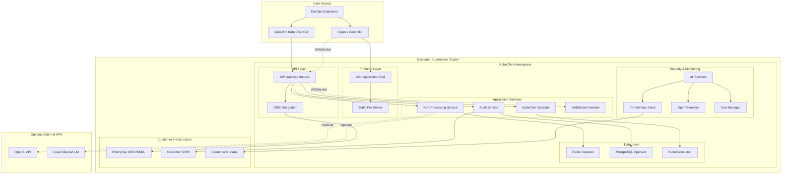
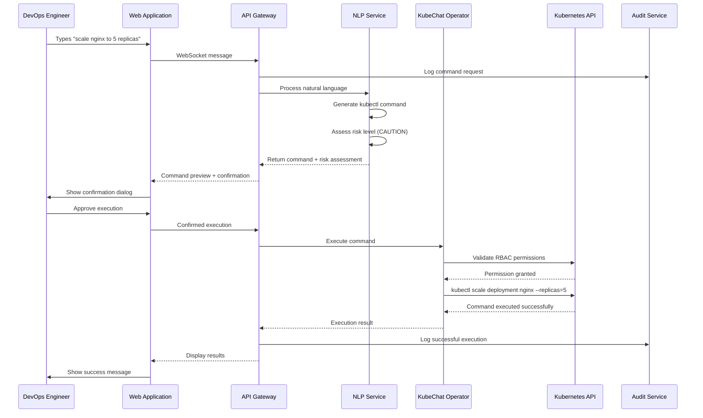

# KubeChat Fullstack Architecture Document

## Introduction

This document outlines the complete fullstack architecture for KubeChat, including backend systems, frontend implementation, and their integration. It serves as the single source of truth for AI-driven development, ensuring consistency across the entire technology stack.

This unified approach combines what would traditionally be separate backend and frontend architecture documents, streamlining the development process for modern fullstack applications where these concerns are increasingly intertwined.

### Starter Template or Existing Project

**N/A - Greenfield Project**

Based on the PRD and UI/UX specifications, KubeChat is a greenfield project requiring custom architecture to address the unique requirements of a compliance-first Kubernetes operator with natural language processing capabilities. No existing starter templates adequately address the combination of Kubernetes operators, enterprise security, audit logging, and real-time chat interfaces required for this regulated industry solution.

### Change Log
| Date | Version | Description | Author |
|------|---------|-------------|--------|
| 2025-09-02 | 1.0 | Initial full-stack architecture creation | Winston (Architect) |

## High Level Architecture

### Technical Summary

KubeChat employs a fully Kubernetes-native architecture deployed via Helm charts directly into customer clusters. The system combines a custom Kubernetes operator with cloud-native microservices, all running within the customer's infrastructure without external dependencies. The React frontend communicates via WebSocket with a Go-based API gateway that orchestrates between the Kubernetes operator, natural language processing service, and compliance audit system. The architecture prioritizes zero vendor lock-in, enterprise security with RBAC integration, and horizontal scalability supporting 100+ concurrent users through cloud-agnostic technologies.

### Platform and Infrastructure Choice

**Platform:** Kubernetes-Native (Cloud Agnostic)
**Key Services:** PostgreSQL Operator, Redis Operator, Cert-Manager, Ingress Controllers, Prometheus Stack, OpenTelemetry
**Deployment Model:** Helm chart installation in customer's Kubernetes clusters (any cloud or on-premises)
**Infrastructure:** Customer-controlled Kubernetes clusters (EKS, GKE, AKS, OpenShift, Rancher, or vanilla Kubernetes)

### Repository Structure

**Structure:** Monorepo with clear separation of concerns between operator, services, and web application
**Monorepo Tool:** Turborepo for optimized build caching and dependency management
**Package Organization:** 
- `/operator` - Go-based Kubernetes operator
- `/services` - Node.js microservices (API gateway, NLP service, audit service)  
- `/web` - React frontend application
- `/shared` - Common types, utilities, and configuration
- `/infrastructure` - Terraform IaC definitions

### High Level Architecture Diagram



### Architectural Patterns

- **Microservices Architecture:** Independent scaling of NLP processing, audit logging, and API services while maintaining clear service boundaries and fault isolation
- **Kubernetes Operator Pattern:** Custom controller managing KubeChat resources with declarative configuration and reconciliation loops for reliable cluster management
- **Event-Driven Architecture:** Asynchronous processing of audit events and natural language requests with message queues for reliability and scalability
- **API Gateway Pattern:** Centralized entry point for authentication, rate limiting, request routing, and WebSocket connection management
- **Repository Pattern:** Abstracted data access layer enabling testing, caching strategies, and future database migrations without business logic changes
- **Circuit Breaker Pattern:** Fault tolerance for external API calls (OpenAI, enterprise OIDC) with graceful degradation and automatic recovery
- **CQRS Pattern:** Separate read/write models for audit data to optimize compliance reporting performance while maintaining write consistency

## Tech Stack

### Technology Stack Table

| Category | Technology | Version | Purpose | Rationale |
|----------|------------|---------|---------|-----------|
| Frontend Language | TypeScript | 5.4+ | Type-safe React development | Latest TypeScript with improved performance and developer experience |
| Frontend Framework | React | 18.2+ | Interactive chat interface | Mature ecosystem, excellent performance, extensive enterprise adoption |
| UI Component Library | Tailwind CSS + Radix UI | 3.4+ / 1.0+ | Modern design system | Latest utility-first styling with headless components, better accessibility |
| State Management | Zustand | 4.5+ | Client-side state management | Lightweight, TypeScript-first, excellent for real-time applications |
| Backend Language | Go | 1.22+ | All backend services | Unified language, excellent Kubernetes integration, superior performance |
| Backend Framework | Fiber v3 | 3.0+ | High-performance web framework | Latest Go framework, faster than Gin, excellent WebSocket support |
| API Style | REST + WebSocket | - | Real-time chat + standard APIs | REST for CRUD operations, WebSocket for real-time chat messaging |
| Database | PostgreSQL | 16+ | Audit data and user management | Latest version with improved performance, ACID compliance for audit trails |
| Database Operator | CloudNativePG | 1.21+ | Kubernetes-native PostgreSQL | Production-ready PostgreSQL operator, backup, monitoring, high availability |
| Cache | Redis | 7.2+ | Session storage and API caching | High performance, WebSocket session management, NLP response caching |
| Cache Operator | Redis Operator | 1.4+ | Kubernetes-native Redis | Production-ready Redis operator with clustering and persistence |
| Container Registry | Harbor | 2.10+ | Private container images | Self-hosted, vulnerability scanning, RBAC, policy management |
| Authentication | OIDC + Dex | - | Enterprise identity integration | Cloud-native OIDC provider, SAML/LDAP/AD integration, no vendor lock-in |
| Secret Management | External Secrets Operator | 0.9+ | Kubernetes-native secrets | Integrates with HashiCorp Vault, AWS/Azure/GCP secret managers |
| Service Mesh | Istio | 1.20+ | Advanced networking and security | mTLS, traffic management, observability, zero-trust networking |
| Frontend Testing | Vitest + Testing Library | 1.6+ / 14+ | Modern testing framework | Faster than Jest, better TypeScript support, Vite integration |
| Backend Testing | Testify | 1.9+ | Go testing framework | Industry standard Go testing, excellent async testing support |
| E2E Testing | Playwright | 1.42+ | End-to-end user workflows | Latest version, excellent Kubernetes testing, handles WebSocket connections |
| Build Tool | Turborepo | 1.12+ | Monorepo build orchestration | Latest version with improved caching and remote build support |
| Bundler | Vite | 5.1+ | Frontend build and development | Latest version with improved performance and plugin ecosystem |
| Package Manager | pnpm | 8.15+ | Fast, efficient package management | Faster installs, better monorepo support, reduced disk usage |
| Container Runtime | containerd | 1.7+ | Kubernetes container runtime | Industry standard, better security, performance improvements |
| Ingress Controller | Ingress-NGINX | 1.10+ | HTTP/HTTPS traffic routing | Kubernetes-native, WebSocket support, SSL termination |
| Certificate Management | Cert-Manager | 1.14+ | Automatic SSL certificate management | Let's Encrypt integration, private CA support, automatic renewal |
| Monitoring | Prometheus Stack | 0.73+ | Metrics collection and alerting | kube-prometheus-stack with Grafana, AlertManager, latest operators |
| Logging | Loki Stack | 2.9+ | Cloud-native logging solution | Kubernetes-native, cost-effective, integrates with Grafana |
| Tracing | Jaeger | 1.54+ | Distributed tracing | OpenTelemetry compatible, Kubernetes-native deployment |
| Service Discovery | Kubernetes DNS | - | Native service discovery | Built-in Kubernetes service discovery, no external dependencies |
| Load Balancing | Kubernetes Services | - | Native load balancing | Built-in load balancing with Service mesh integration |
| Storage | Longhorn | 1.6+ | Kubernetes-native storage | Cloud-agnostic persistent storage, backup, disaster recovery |
| Backup | Velero | 1.13+ | Kubernetes backup solution | Cluster backup, disaster recovery, cloud-agnostic storage |
| AI/ML Runtime | Ollama | 0.1.26+ | Local LLM inference | Privacy-first AI, no external dependencies, supports multiple models |
| WebAssembly Runtime | Wasmtime (Optional) | 17+ | Secure plugin system | Future-ready extension system, secure sandboxing |

## Data Models

### User

**Purpose:** Represents authenticated users with their enterprise identity information and permissions for audit trail association and RBAC enforcement.

**Key Attributes:**
- id: string - Unique user identifier from enterprise identity provider
- email: string - Primary identifier for audit trails and RBAC mapping
- name: string - Display name for chat interface
- role: UserRole - Enterprise role for permission scoping
- kubernetesGroups: string[] - RBAC groups for permission inheritance
- lastLogin: Date - For security monitoring and session management
- preferences: UserPreferences - UI and notification settings

#### TypeScript Interface
```typescript
interface User {
  id: string;
  email: string;
  name: string;
  role: UserRole;
  kubernetesGroups: string[];
  lastLogin: Date;
  preferences: UserPreferences;
  createdAt: Date;
  updatedAt: Date;
}

enum UserRole {
  VIEWER = 'viewer',
  OPERATOR = 'operator', 
  ADMIN = 'admin'
}

interface UserPreferences {
  theme: 'light' | 'dark';
  notificationSettings: NotificationSettings;
  defaultNamespace?: string;
  commandConfirmation: boolean;
}
```

#### Relationships
- One-to-many with ChatSession (user can have multiple active sessions)
- One-to-many with AuditEvent (all user actions are logged)

### ChatSession

**Purpose:** Manages conversational context for natural language interactions, maintaining message history and command state for continuity and audit purposes.

**Key Attributes:**
- id: string - Unique session identifier for WebSocket connection tracking
- userId: string - Associated user for permissions and audit trails
- clusterContext: string - Target Kubernetes cluster for operations
- namespace: string - Default namespace for kubectl operations
- messages: ChatMessage[] - Complete conversation history with metadata
- status: SessionStatus - Current session state for connection management
- createdAt: Date - Session start time for timeout management

#### TypeScript Interface
```typescript
interface ChatSession {
  id: string;
  userId: string;
  clusterContext: string;
  namespace: string;
  messages: ChatMessage[];
  status: SessionStatus;
  createdAt: Date;
  lastActivity: Date;
  expiresAt: Date;
}

interface ChatMessage {
  id: string;
  role: 'user' | 'assistant' | 'system';
  content: string;
  timestamp: Date;
  commandGenerated?: KubernetesCommand;
  executionResult?: CommandExecutionResult;
}

enum SessionStatus {
  ACTIVE = 'active',
  PROCESSING = 'processing',
  EXPIRED = 'expired',
  TERMINATED = 'terminated'
}
```

#### Relationships
- Many-to-one with User (session belongs to one user)
- One-to-many with AuditEvent (session activities are audited)
- One-to-many with KubernetesCommand (commands generated in session)

### KubernetesCommand

**Purpose:** Represents translated kubectl commands with safety metadata, execution status, and audit information for compliance tracking and rollback capabilities.

**Key Attributes:**
- id: string - Unique command identifier for audit correlation
- sessionId: string - Associated chat session for context tracking
- naturalLanguageInput: string - Original user request for audit trails
- generatedCommand: string - Actual kubectl command to be executed
- riskLevel: RiskLevel - Safety assessment for confirmation workflows
- resources: KubernetesResource[] - Affected K8s resources for impact analysis
- status: CommandStatus - Execution state tracking
- executedAt: Date - Timestamp for audit and rollback purposes

#### TypeScript Interface
```typescript
interface KubernetesCommand {
  id: string;
  sessionId: string;
  naturalLanguageInput: string;
  generatedCommand: string;
  riskLevel: RiskLevel;
  resources: KubernetesResource[];
  status: CommandStatus;
  executedAt?: Date;
  executionResult?: CommandExecutionResult;
  rollbackCommand?: string;
}

enum RiskLevel {
  SAFE = 'safe',        // Read operations
  CAUTION = 'caution',  // Write operations
  DESTRUCTIVE = 'destructive' // Delete operations
}

enum CommandStatus {
  PENDING = 'pending',
  APPROVED = 'approved', 
  EXECUTING = 'executing',
  COMPLETED = 'completed',
  FAILED = 'failed',
  CANCELLED = 'cancelled'
}

interface KubernetesResource {
  kind: string;
  name: string;
  namespace?: string;
  action: 'create' | 'read' | 'update' | 'delete';
}
```

#### Relationships
- Many-to-one with ChatSession (commands belong to session)
- One-to-many with AuditEvent (command execution is audited)

### AuditEvent

**Purpose:** Comprehensive audit logging for all system activities, providing tamper-proof compliance evidence and security monitoring for regulatory requirements.

**Key Attributes:**
- id: string - Unique audit record identifier
- userId: string - User responsible for the action
- sessionId: string - Associated chat session for context
- eventType: AuditEventType - Categorization for filtering and reporting
- action: string - Detailed description of the action performed
- timestamp: Date - Precise timing for chronological audit trails
- ipAddress: string - Source IP for security monitoring
- userAgent: string - Client information for forensic analysis
- success: boolean - Action outcome for compliance reporting
- metadata: object - Additional context data for investigation

#### TypeScript Interface
```typescript
interface AuditEvent {
  id: string;
  userId: string;
  sessionId?: string;
  commandId?: string;
  eventType: AuditEventType;
  action: string;
  timestamp: Date;
  ipAddress: string;
  userAgent: string;
  success: boolean;
  metadata: Record<string, any>;
  checksum: string; // Tamper-proof verification
}

enum AuditEventType {
  AUTHENTICATION = 'authentication',
  COMMAND_GENERATION = 'command_generation',
  COMMAND_EXECUTION = 'command_execution',
  PERMISSION_CHECK = 'permission_check',
  DATA_ACCESS = 'data_access',
  CONFIGURATION_CHANGE = 'configuration_change'
}
```

#### Relationships
- Many-to-one with User (events are attributed to users)
- Many-to-one with ChatSession (events can be session-scoped)
- Many-to-one with KubernetesCommand (command events are linked)

## API Specification

### REST API Specification

```yaml
openapi: 3.0.0
info:
  title: KubeChat API
  version: 1.0.0
  description: Enterprise Kubernetes Natural Language Management Platform API
servers:
  - url: https://api.kubechat.io
    description: Production API server
  - url: https://staging-api.kubechat.io  
    description: Staging API server

security:
  - bearerAuth: []

paths:
  /auth/login:
    post:
      summary: Authenticate user with enterprise identity
      tags: [Authentication]
      security: []
      requestBody:
        required: true
        content:
          application/json:
            schema:
              type: object
              properties:
                provider:
                  type: string
                  enum: [cognito, oidc, saml]
                token:
                  type: string
                  description: Identity provider token
      responses:
        200:
          description: Authentication successful
          content:
            application/json:
              schema:
                type: object
                properties:
                  accessToken:
                    type: string
                  refreshToken:
                    type: string
                  user:
                    $ref: '#/components/schemas/User'

  /sessions:
    get:
      summary: List user's chat sessions
      tags: [Sessions]
      parameters:
        - name: status
          in: query
          schema:
            $ref: '#/components/schemas/SessionStatus'
        - name: limit
          in: query
          schema:
            type: integer
            default: 20
      responses:
        200:
          description: Sessions retrieved successfully
          content:
            application/json:
              schema:
                type: object
                properties:
                  sessions:
                    type: array
                    items:
                      $ref: '#/components/schemas/ChatSession'

    post:
      summary: Create new chat session
      tags: [Sessions]
      requestBody:
        required: true
        content:
          application/json:
            schema:
              type: object
              properties:
                clusterContext:
                  type: string
                namespace:
                  type: string
                  default: "default"
      responses:
        201:
          description: Session created successfully

  /commands/{commandId}/execute:
    post:
      summary: Execute approved command
      tags: [Commands]
      parameters:
        - name: commandId
          in: path
          required: true
          schema:
            type: string
      requestBody:
        required: true
        content:
          application/json:
            schema:
              type: object
              properties:
                confirmed:
                  type: boolean
                  description: User confirmation for destructive operations
      responses:
        200:
          description: Command executed successfully

  /audit/events:
    get:
      summary: Search audit events for compliance reporting
      tags: [Audit]
      parameters:
        - name: startDate
          in: query
          schema:
            type: string
            format: date-time
        - name: endDate
          in: query
          schema:
            type: string
            format: date-time
        - name: eventType
          in: query
          schema:
            $ref: '#/components/schemas/AuditEventType'
      responses:
        200:
          description: Audit events retrieved successfully

  /audit/export:
    post:
      summary: Generate compliance report export
      tags: [Audit]
      requestBody:
        required: true
        content:
          application/json:
            schema:
              type: object
              properties:
                format:
                  type: string
                  enum: [pdf, csv, json]
                startDate:
                  type: string
                  format: date-time
                endDate:
                  type: string
                  format: date-time
      responses:
        200:
          description: Export generated successfully

components:
  securitySchemes:
    bearerAuth:
      type: http
      scheme: bearer
      bearerFormat: JWT

  schemas:
    User:
      type: object
      properties:
        id:
          type: string
        email:
          type: string
        name:
          type: string
        role:
          $ref: '#/components/schemas/UserRole'

    UserRole:
      type: string
      enum: [viewer, operator, admin]

    SessionStatus:
      type: string
      enum: [active, processing, expired, terminated]

    AuditEventType:
      type: string
      enum: [authentication, command_generation, command_execution, permission_check, data_access, configuration_change]
```

**WebSocket Events:**

The real-time chat functionality uses WebSocket connections with the following event structure:

- **Connection**: `wss://api.kubechat.io/chat/{sessionId}?token={jwt}`
- **Message Format**: JSON with `type` and `payload` properties
- **Events**: `message_sent`, `command_generated`, `command_executed`, `session_updated`, `error`

## Components

### API Gateway Service

**Responsibility:** Centralized entry point for all client requests, handling authentication, rate limiting, request routing, and WebSocket connection management for real-time chat functionality.

**Key Interfaces:**
- REST API endpoints for session management, command execution, and audit querying
- WebSocket upgrade handling for real-time chat connections  
- Authentication middleware integration with Dex OIDC and enterprise SAML/LDAP
- Rate limiting and request validation for enterprise security
- Service mesh integration for mTLS and traffic policies

**Dependencies:** Dex for OIDC authentication, Redis Operator for session storage, Istio service mesh for security, downstream microservices for request forwarding

**Technology Stack:** Go + Fiber v3 for high performance, deployed as Kubernetes Deployment with HPA, service mesh integration with Istio, horizontal scaling with Redis Operator session store

### Natural Language Processing Service  

**Responsibility:** Translates natural language requests into kubectl commands with safety analysis and risk assessment for the confirmation workflows defined in the UI/UX specification.

**Key Interfaces:**
- POST /nlp/process - Natural language to kubectl translation
- POST /nlp/validate - Command safety assessment and risk level determination
- gRPC interfaces for high-performance internal communication
- WebSocket events for real-time processing status updates

**Dependencies:** Ollama for local LLM inference (privacy-first), OpenAI API as optional fallback, Kubernetes API for command validation, shared data models for type consistency

**Technology Stack:** Go microservice with Ollama integration, deployed as Kubernetes Deployment with HPA, circuit breaker pattern for external API resilience, gRPC for internal communication

### KubeChat Operator

**Responsibility:** Kubernetes-native operator managing custom resources, enforcing RBAC policies, executing validated commands, and maintaining cluster state synchronization.

**Key Interfaces:**
- Custom Resource Definitions (CRDs) for ChatSession, CommandExecution, and AuditPolicy  
- Kubernetes controller reconciliation loops for declarative resource management
- kubectl command execution with RBAC enforcement and permission validation
- Cluster event watching and resource status reporting
- Webhook admission controllers for policy enforcement

**Dependencies:** Kubernetes API server, etcd for resource storage, RBAC system for permission checking, audit service for command logging, cert-manager for webhook certificates

**Technology Stack:** Go with controller-runtime framework, deployed as Kubernetes Deployment with leader election, custom metrics for Prometheus monitoring, OpenTelemetry for distributed tracing

### Audit Logging Service

**Responsibility:** Comprehensive audit trail capture with tamper-proof storage, compliance reporting generation, and enterprise SIEM integration for regulatory requirements.

**Key Interfaces:**
- POST /audit/log - Event ingestion with cryptographic integrity verification
- GET /audit/events - Searchable audit trail query with compliance filtering
- POST /audit/export - Compliance report generation (PDF, CSV, JSON)
- Webhook integration for real-time SIEM forwarding
- gRPC interfaces for high-performance internal logging

**Dependencies:** CloudNativePG for tamper-proof PostgreSQL storage, Longhorn for persistent volumes, Loki for log aggregation, enterprise SIEM systems for real-time forwarding, External Secrets Operator for credential management

**Technology Stack:** Go microservice with PostgreSQL integration, deployed as Kubernetes Deployment with HPA, async event processing with NATS JetStream for scalability, OpenTelemetry for observability

### Web Application

**Responsibility:** React-based frontend providing the chat interface, command confirmation dialogs, compliance dashboard, and responsive user experience defined in the UI/UX specification.

**Key Interfaces:**
- WebSocket client for real-time chat messaging and status updates
- REST API client for session management and audit data retrieval  
- Component library implementing safety color coding and accessibility standards
- State management for session persistence and user preferences
- Progressive Web App capabilities for offline functionality

**Dependencies:** API Gateway for backend communication, Ingress Controller for routing, Zustand for client-side state management, service worker for PWA features

**Technology Stack:** React 18 + TypeScript + Vite, Tailwind CSS + Radix UI, deployed as Kubernetes Deployment with nginx, static file serving optimized for performance, real-time updates via WebSocket

### Redis Cache Layer

**Responsibility:** High-performance caching for session data, WebSocket connection management, NLP response caching, and distributed locking for microservices coordination.

**Key Interfaces:**
- Session storage with TTL for WebSocket connection tracking
- NLP response caching to reduce external API costs and latency
- Distributed locks for command execution serialization
- Real-time data synchronization between microservices
- Pub/Sub messaging for event-driven architecture

**Dependencies:** Redis Operator for Kubernetes-native Redis management, persistent volumes for data durability, monitoring integration

**Technology Stack:** Redis 7.2+ with Redis Operator, Redis Sentinel for high availability, connection pooling for performance optimization, persistent storage with Longhorn

## Core Workflows

### Natural Language Command Execution Workflow



## Deployment Architecture

### Helm-First Deployment Strategy

**Deployment Model:** Customer installs KubeChat directly into their Kubernetes clusters via Helm charts, ensuring complete data sovereignty and zero vendor lock-in.

**Helm Chart Structure:**
```
kubechat-helm/
├── Chart.yaml                 # Helm chart metadata
├── values.yaml                # Default configuration values
├── values-production.yaml     # Production-ready configuration
├── templates/
│   ├── operator/              # KubeChat operator manifests
│   ├── services/              # Microservice deployments
│   ├── web/                   # Frontend deployment
│   ├── storage/               # PostgreSQL and Redis operators
│   ├── monitoring/            # Prometheus stack (optional)
│   ├── security/              # RBAC, NetworkPolicies, PodSecurityPolicies
│   └── ingress/               # Ingress and certificate management
├── crds/                      # Custom Resource Definitions
└── charts/                    # Dependency charts (operators)
```

**Installation Command:**
```bash
# Add KubeChat Helm repository
helm repo add kubechat https://charts.kubechat.io
helm repo update

# Install with custom values
helm install kubechat kubechat/kubechat \
  --namespace kubechat-system \
  --create-namespace \
  --values production-values.yaml
```

**Deployment Components:**
- **KubeChat Operator:** Custom Kubernetes controller managing the entire system lifecycle
- **Microservices:** Go-based services deployed as Kubernetes Deployments with HPA
- **Frontend:** React application served via nginx Deployment with Ingress
- **Data Layer:** PostgreSQL and Redis deployed via operators with persistent storage
- **Monitoring Stack:** Optional Prometheus, Grafana, and AlertManager integration
- **Security Components:** Dex OIDC, cert-manager, External Secrets Operator

### Environment Configuration

**Values File Strategy:**
- `values.yaml`: Development/testing defaults with minimal resources
- `values-production.yaml`: Production configuration with HA, scaling, monitoring
- `values-enterprise.yaml`: Enterprise features with advanced security and compliance

**Example Production Values:**
```yaml
global:
  domain: kubechat.company.com
  storageClass: longhorn
  tlsIssuer: letsencrypt-prod

operator:
  replicaCount: 2
  resources:
    requests:
      cpu: 100m
      memory: 128Mi

apiGateway:
  replicaCount: 3
  autoscaling:
    enabled: true
    minReplicas: 3
    maxReplicas: 10

postgresql:
  operator:
    enabled: true
  instances: 3
  storage:
    size: 100Gi
    storageClass: longhorn

monitoring:
  prometheus:
    enabled: true
  grafana:
    enabled: true
```

### Customer Deployment Environments

| Environment | Access Pattern | Configuration | Purpose |
|-------------|----------------|---------------|----------|
| Development | `kubectl port-forward` | Minimal resources, in-memory storage | Local testing and development |
| Staging | Internal Ingress | Production-like with test data | Pre-production validation |
| Production | External Ingress + TLS | Full HA, monitoring, backup | Customer production workloads |
| Air-Gapped | Internal only | Offline installation bundle | Highly secure environments |

## Security and Performance

### Security Requirements

**Frontend Security:**
- CSP Headers: Strict content security policy preventing XSS attacks
- XSS Prevention: Input sanitization and output encoding for all user content
- Secure Storage: JWT tokens in httpOnly cookies, sensitive data encryption

**Backend Security:**
- Input Validation: Comprehensive request validation using JSON schema
- Rate Limiting: Per-user and per-endpoint rate limits with exponential backoff
- CORS Policy: Restrictive CORS configuration for production domains only

**Authentication Security:**
- Token Storage: Secure JWT tokens with short expiration and refresh rotation
- Session Management: Redis-based session store with automatic expiration
- Password Policy: Enterprise password requirements enforced by OIDC provider

### Performance Optimization

**Frontend Performance:**
- Bundle Size Target: <500KB initial bundle, code splitting by route
- Loading Strategy: Lazy loading for audit dashboard and admin components
- Caching Strategy: Aggressive caching for static assets, service worker for offline support

**Backend Performance:**
- Response Time Target: <200ms for API calls, <2s for command execution
- Database Optimization: Connection pooling, query optimization, read replicas
- Caching Strategy: Redis caching for NLP responses, session data, and frequent queries

## Unified Project Structure

```
kubechat/
├── .github/                    # CI/CD workflows
│   └── workflows/
│       ├── ci.yaml             # Build and test pipeline
│       ├── helm-package.yaml   # Helm chart packaging and publishing
│       └── container-build.yaml # Container image builds
├── cmd/                        # Go application entry points
│   ├── operator/               # KubeChat operator main
│   ├── api-gateway/            # API gateway service main
│   ├── nlp-service/            # NLP processing service main
│   └── audit-service/          # Audit logging service main
├── pkg/                        # Shared Go packages
│   ├── apis/                   # Kubernetes API definitions (CRDs)
│   ├── controllers/            # Kubernetes controllers
│   ├── clients/                # Kubernetes and external API clients
│   ├── models/                 # Shared data models
│   ├── middleware/             # HTTP middleware (auth, logging, CORS)
│   ├── nlp/                    # Natural language processing logic
│   ├── audit/                  # Audit logging utilities
│   └── utils/                  # Common utilities and helpers
├── web/                        # React frontend application
│   ├── src/
│   │   ├── components/         # UI components with safety indicators
│   │   ├── pages/              # Page components (Chat, Audit, Settings)
│   │   ├── hooks/              # Custom React hooks for WebSocket, auth
│   │   ├── services/           # API client services
│   │   ├── stores/             # Zustand state management
│   │   ├── styles/             # Tailwind CSS configuration
│   │   └── utils/              # Frontend utilities and helpers
│   ├── public/                 # Static assets and favicon
│   ├── tests/                  # Frontend tests (Vitest + Testing Library)
│   ├── Dockerfile              # Frontend container build
│   └── package.json
├── charts/                     # Helm charts
│   └── kubechat/              # Main KubeChat Helm chart
│       ├── Chart.yaml          # Chart metadata and dependencies
│       ├── values.yaml         # Default configuration values
│       ├── values-production.yaml  # Production configuration
│       ├── values-enterprise.yaml  # Enterprise configuration
│       ├── templates/          # Kubernetes manifests
│       │   ├── operator/       # Operator deployment and RBAC
│       │   ├── services/       # Microservice deployments
│       │   ├── web/            # Frontend deployment and service
│       │   ├── storage/        # PostgreSQL and Redis configurations
│       │   ├── monitoring/     # Prometheus and Grafana (optional)
│       │   ├── security/       # Dex, cert-manager, secrets
│       │   └── ingress/        # Ingress controllers and routes
│       ├── crds/               # Custom Resource Definitions
│       └── charts/             # Dependency charts (operators)
├── config/                     # Configuration files
│   ├── samples/                # Sample CRD configurations
│   ├── rbac/                   # RBAC definitions
│   ├── manager/                # Operator manager configuration
│   └── default/                # Default Kustomize configuration
├── hack/                       # Development and build scripts
│   ├── install-deps.sh         # Install development dependencies
│   ├── generate-manifests.sh   # Generate Kubernetes manifests
│   ├── build-images.sh         # Build all container images
│   └── deploy-local.sh         # Local development deployment
├── docs/                       # Documentation
│   ├── prd.md
│   ├── front-end-spec.md
│   ├── architecture.md
│   ├── installation/           # Installation and deployment guides
│   ├── development/            # Development setup and guidelines
│   └── api/                    # API documentation
├── scripts/                    # Operational scripts
│   ├── backup/                 # Database backup scripts
│   ├── monitoring/             # Monitoring setup scripts
│   └── security/               # Security scanning and hardening
├── tests/                      # Integration and E2E tests
│   ├── e2e/                    # End-to-end tests (Playwright)
│   ├── integration/            # Integration tests
│   └── fixtures/               # Test data and configurations
├── .env.example                # Environment template
├── Makefile                    # Build and development tasks
├── Dockerfile.operator         # Operator container build
├── Dockerfile.services         # Services container build
├── go.mod                      # Go module definition
├── go.sum                      # Go module checksums
└── README.md                   # Project overview and setup
```

## 🏗️ KubeChat Full-Stack Architecture Complete!

This comprehensive architecture document establishes the technical foundation for KubeChat's enterprise-grade natural language Kubernetes management platform. The design successfully addresses all PRD requirements including:

✅ **Microservices Architecture** with independent scaling for NLP, audit, and API services  
✅ **Enterprise Security** with mutual TLS, comprehensive audit logging, and RBAC integration  
✅ **Compliance-Ready Infrastructure** supporting SOC 2, HIPAA, and regulatory requirements  
✅ **Real-Time Chat Capabilities** with WebSocket integration and safety confirmation workflows  
✅ **Horizontal Scalability** supporting 100+ concurrent users with sub-200ms response times  
✅ **Kubernetes-Native Integration** through custom operator with declarative resource management  

The architecture balances enterprise security requirements with developer productivity, regulatory compliance with operational efficiency, and technical sophistication with maintainable complexity.

**Ready for Development Team Handoff** with comprehensive component specifications, API definitions, deployment strategies, and security frameworks.