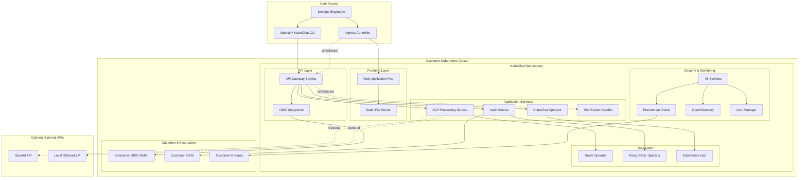
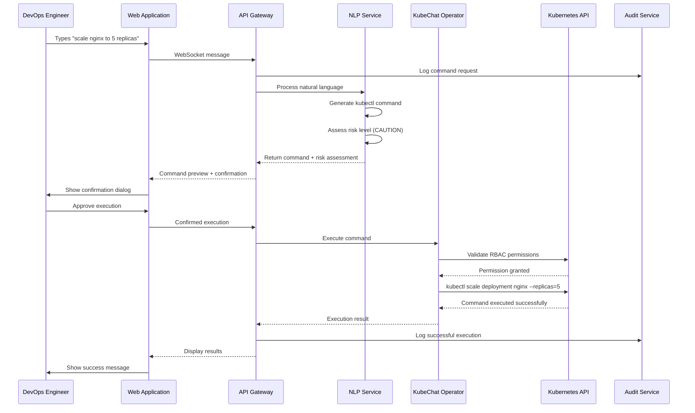

# KubeChat Fullstack Architecture Document

## Introduction

This document outlines the complete fullstack architecture for KubeChat, including backend systems, frontend implementation, and their integration. It serves as the single source of truth for AI-driven development, ensuring consistency across the entire technology stack.

This unified approach combines what would traditionally be separate backend and frontend architecture documents, streamlining the development process for modern fullstack applications where these concerns are increasingly intertwined.

### Starter Template or Existing Project

**N/A - Greenfield Project**

Based on the PRD and UI/UX specifications, KubeChat is a greenfield project requiring custom architecture to address the unique requirements of a compliance-first Kubernetes operator with natural language processing capabilities. No existing starter templates adequately address the combination of Kubernetes operators, enterprise security, audit logging, and real-time chat interfaces required for this regulated industry solution.

### Change Log
| Date | Version | Description | Author |
|------|---------|-------------|--------|
| 2025-09-02 | 1.0 | Initial full-stack architecture creation | Winston (Architect) |

## High Level Architecture

### Technical Summary

KubeChat employs a **Phase 1 Model 1 (On-Premises FREE Platform)** architecture deployed via Helm charts directly into customer-controlled Kubernetes clusters. The system combines Go-based microservices (api-gateway, nlp-service, audit-service) with a React frontend, all running within the customer's infrastructure with **complete data sovereignty and air-gap capability**. The React frontend communicates via WebSocket with the Go-based API gateway. The architecture prioritizes **zero vendor lock-in**, **enterprise security with OIDC/SAML integration**, **comprehensive audit trails**, and scalability supporting **1000+ concurrent users** as specified in PRD performance requirements.

### Platform and Infrastructure Choice

**Platform:** **On-Premises Kubernetes (Phase 1 Model 1 PRIMARY Focus)**
**Key Services:** PostgreSQL, Redis, External Secrets Operator, cert-manager (all customer-controlled)
**Deployment Model:** **Air-gap capable Helm chart installation** in customer's infrastructure
**Infrastructure:** Customer-controlled Kubernetes clusters (any cloud or on-premises, air-gap compatible)
**Data Sovereignty:** 100% customer-controlled with **zero vendor access** to customer data

### Repository Structure

**Structure:** Monorepo aligned with **BMAD methodology** and current project structure
**Monorepo Tool:** Turborepo for optimized build caching and dependency management
**Package Organization:** 
- `/cmd` - Go application entry points (api-gateway, nlp-service, audit-service)
- `/pkg` - Shared Go packages (models, clients, middleware, audit)
- `/web` - React frontend application (Epic 4 - Web Interface)
- `/config` - Kubernetes CRDs and RBAC definitions
- `/deploy` - Helm charts for customer deployment
- `/.bmad` - BMAD framework for story-driven development

### High Level Architecture Diagram



### Architectural Patterns

- **Microservices Architecture:** Independent scaling of NLP processing, audit logging, and API services while maintaining clear service boundaries and fault isolation
- **Kubernetes Operator Pattern:** Custom controller managing KubeChat resources with declarative configuration and reconciliation loops for reliable cluster management
- **Event-Driven Architecture:** Asynchronous processing of audit events and natural language requests with message queues for reliability and scalability
- **API Gateway Pattern:** Centralized entry point for authentication, rate limiting, request routing, and WebSocket connection management
- **Repository Pattern:** Abstracted data access layer enabling testing, caching strategies, and future database migrations without business logic changes
- **Circuit Breaker Pattern:** Fault tolerance for external API calls (OpenAI, enterprise OIDC) with graceful degradation and automatic recovery
- **CQRS Pattern:** Separate read/write models for audit data to optimize compliance reporting performance while maintaining write consistency

## Tech Stack

### Technology Stack Table

| Category | Technology | Version | Purpose | Rationale |
|----------|------------|---------|---------|-----------|
| Frontend Language | TypeScript | 5.4+ | Type-safe React development | Latest TypeScript with improved performance and developer experience |
| Frontend Framework | React | 18.2+ | Interactive chat interface | Mature ecosystem, excellent performance, extensive enterprise adoption |
| UI Component Library | Tailwind CSS + Radix UI | 3.4+ / 1.0+ | Modern design system | Latest utility-first styling with headless components, better accessibility |
| State Management | Zustand | 4.5+ | Client-side state management | Lightweight, TypeScript-first, excellent for real-time applications |
| Backend Language | Go | 1.22+ | All backend services | **Phase 1 Model 1 primary language**, excellent Kubernetes integration, enterprise performance |
| Backend Framework | Native Go HTTP + Gorilla WebSocket | 1.22+ stdlib + v1.5+ | Web services and WebSocket | **Phase 1 Model 1 focus**, proven enterprise patterns, minimal dependencies for air-gap deployment |
| API Style | REST + WebSocket | - | Real-time chat + standard APIs | REST for CRUD operations, WebSocket for real-time chat messaging |
| Database | PostgreSQL | 16+ | Audit data and user management | Latest version with improved performance, ACID compliance for audit trails |
| Database Deployment | PostgreSQL Helm Chart | 16+ | Customer-managed PostgreSQL | **Phase 1 Model 1**: Customer-controlled database with backup integration |
| Cache | Redis | 7.2+ | Session storage and API caching | High performance, WebSocket session management, NLP response caching |
| Cache Deployment | Redis Helm Chart | 7.2+ | Customer-managed Redis | **Phase 1 Model 1**: Customer-controlled Redis with persistence and clustering |
| Container Registry | Customer Registry | Any | Private container images | **Phase 1 Model 1**: Customer-controlled registry (Harbor, Docker Registry, or cloud registry) |
| Authentication | OIDC/SAML Integration | - | Enterprise identity integration | **Phase 1 Model 1**: Direct integration with customer identity providers (AD, Okta, Auth0) |
| Secret Management | Kubernetes Secrets + Optional ESO | 0.9+ | Customer-controlled secrets | **Phase 1 Model 1**: Native K8s secrets, optional integration with customer Vault/secret managers |
| Service Mesh | Optional Istio Integration | 1.20+ | Customer service mesh | **Phase 1 Model 1**: Optional integration with customer's existing service mesh |
| Frontend Testing | Vitest + Testing Library | 1.6+ / 14+ | Modern testing framework | Faster than Jest, better TypeScript support, Vite integration |
| Backend Testing | Testify | 1.9+ | Go testing framework | Industry standard Go testing, excellent async testing support |
| E2E Testing | Playwright | 1.42+ | End-to-end user workflows | Latest version, excellent Kubernetes testing, handles WebSocket connections |
| Build Tool | Turborepo | 1.12+ | Monorepo build orchestration | Latest version with improved caching and remote build support |
| Bundler | Vite | 5.1+ | Frontend build and development | Latest version with improved performance and plugin ecosystem |
| Package Manager | pnpm | 8.15+ | Fast, efficient package management | Faster installs, better monorepo support, reduced disk usage |
| Container Runtime | containerd | 1.7+ | Kubernetes container runtime | Industry standard, better security, performance improvements |
| Ingress Controller | Ingress-NGINX | 1.10+ | HTTP/HTTPS traffic routing | Kubernetes-native, WebSocket support, SSL termination |
| Certificate Management | Cert-Manager | 1.14+ | Automatic SSL certificate management | Let's Encrypt integration, private CA support, automatic renewal |
| Monitoring | Prometheus Stack | 0.73+ | Metrics collection and alerting | kube-prometheus-stack with Grafana, AlertManager, latest operators |
| Logging | Loki Stack | 2.9+ | Cloud-native logging solution | Kubernetes-native, cost-effective, integrates with Grafana |
| Tracing | Jaeger | 1.54+ | Distributed tracing | OpenTelemetry compatible, Kubernetes-native deployment |
| Service Discovery | Kubernetes DNS | - | Native service discovery | Built-in Kubernetes service discovery, no external dependencies |
| Load Balancing | Kubernetes Services | - | Native load balancing | Built-in load balancing with Service mesh integration |
| Storage | Longhorn | 1.6+ | Kubernetes-native storage | Cloud-agnostic persistent storage, backup, disaster recovery |
| Backup | Velero | 1.13+ | Kubernetes backup solution | Cluster backup, disaster recovery, cloud-agnostic storage |
| AI/ML Runtime | Local LLM + Optional OpenAI | Various | Natural language processing | **Phase 1 Model 1**: Air-gap compatible local models, optional OpenAI API integration |
| WebAssembly Runtime | Wasmtime (Optional) | 17+ | Secure plugin system | Future-ready extension system, secure sandboxing |

## Data Models

### User

**Purpose:** Represents authenticated users with their enterprise identity information and permissions for audit trail association and RBAC enforcement.

**Key Attributes:**
- id: string - Unique user identifier from enterprise identity provider
- email: string - Primary identifier for audit trails and RBAC mapping
- name: string - Display name for chat interface
- role: UserRole - Enterprise role for permission scoping
- kubernetesGroups: string[] - RBAC groups for permission inheritance
- lastLogin: Date - For security monitoring and session management
- preferences: UserPreferences - UI and notification settings

#### TypeScript Interface
```typescript
interface User {
  id: string;
  email: string;
  name: string;
  role: UserRole;
  kubernetesGroups: string[];
  lastLogin: Date;
  preferences: UserPreferences;
  createdAt: Date;
  updatedAt: Date;
}

enum UserRole {
  VIEWER = 'viewer',
  OPERATOR = 'operator', 
  ADMIN = 'admin'
}

interface UserPreferences {
  theme: 'light' | 'dark';
  notificationSettings: NotificationSettings;
  defaultNamespace?: string;
  commandConfirmation: boolean;
}
```

#### Relationships
- One-to-many with ChatSession (user can have multiple active sessions)
- One-to-many with AuditEvent (all user actions are logged)

### ChatSession

**Purpose:** Manages conversational context for natural language interactions, maintaining message history and command state for continuity and audit purposes.

**Key Attributes:**
- id: string - Unique session identifier for WebSocket connection tracking
- userId: string - Associated user for permissions and audit trails
- clusterContext: string - Target Kubernetes cluster for operations
- namespace: string - Default namespace for kubectl operations
- messages: ChatMessage[] - Complete conversation history with metadata
- status: SessionStatus - Current session state for connection management
- createdAt: Date - Session start time for timeout management

#### TypeScript Interface
```typescript
interface ChatSession {
  id: string;
  userId: string;
  clusterContext: string;
  namespace: string;
  messages: ChatMessage[];
  status: SessionStatus;
  createdAt: Date;
  lastActivity: Date;
  expiresAt: Date;
}

interface ChatMessage {
  id: string;
  role: 'user' | 'assistant' | 'system';
  content: string;
  timestamp: Date;
  commandGenerated?: KubernetesCommand;
  executionResult?: CommandExecutionResult;
}

enum SessionStatus {
  ACTIVE = 'active',
  PROCESSING = 'processing',
  EXPIRED = 'expired',
  TERMINATED = 'terminated'
}
```

#### Relationships
- Many-to-one with User (session belongs to one user)
- One-to-many with AuditEvent (session activities are audited)
- One-to-many with KubernetesCommand (commands generated in session)

### KubernetesCommand

**Purpose:** Represents translated kubectl commands with safety metadata, execution status, and audit information for compliance tracking and rollback capabilities.

**Key Attributes:**
- id: string - Unique command identifier for audit correlation
- sessionId: string - Associated chat session for context tracking
- naturalLanguageInput: string - Original user request for audit trails
- generatedCommand: string - Actual kubectl command to be executed
- riskLevel: RiskLevel - Safety assessment for confirmation workflows
- resources: KubernetesResource[] - Affected K8s resources for impact analysis
- status: CommandStatus - Execution state tracking
- executedAt: Date - Timestamp for audit and rollback purposes

#### TypeScript Interface
```typescript
interface KubernetesCommand {
  id: string;
  sessionId: string;
  naturalLanguageInput: string;
  generatedCommand: string;
  riskLevel: RiskLevel;
  resources: KubernetesResource[];
  status: CommandStatus;
  executedAt?: Date;
  executionResult?: CommandExecutionResult;
  rollbackCommand?: string;
}

enum RiskLevel {
  SAFE = 'safe',        // Read operations
  CAUTION = 'caution',  // Write operations
  DESTRUCTIVE = 'destructive' // Delete operations
}

enum CommandStatus {
  PENDING = 'pending',
  APPROVED = 'approved', 
  EXECUTING = 'executing',
  COMPLETED = 'completed',
  FAILED = 'failed',
  CANCELLED = 'cancelled'
}

interface KubernetesResource {
  kind: string;
  name: string;
  namespace?: string;
  action: 'create' | 'read' | 'update' | 'delete';
}
```

#### Relationships
- Many-to-one with ChatSession (commands belong to session)
- One-to-many with AuditEvent (command execution is audited)

### AuditEvent

**Purpose:** Comprehensive audit logging for all system activities, providing tamper-proof compliance evidence and security monitoring for regulatory requirements.

**Key Attributes:**
- id: string - Unique audit record identifier
- userId: string - User responsible for the action
- sessionId: string - Associated chat session for context
- eventType: AuditEventType - Categorization for filtering and reporting
- action: string - Detailed description of the action performed
- timestamp: Date - Precise timing for chronological audit trails
- ipAddress: string - Source IP for security monitoring
- userAgent: string - Client information for forensic analysis
- success: boolean - Action outcome for compliance reporting
- metadata: object - Additional context data for investigation

#### TypeScript Interface
```typescript
interface AuditEvent {
  id: string;
  userId: string;
  sessionId?: string;
  commandId?: string;
  eventType: AuditEventType;
  action: string;
  timestamp: Date;
  ipAddress: string;
  userAgent: string;
  success: boolean;
  metadata: Record<string, any>;
  checksum: string; // Tamper-proof verification
}

enum AuditEventType {
  AUTHENTICATION = 'authentication',
  COMMAND_GENERATION = 'command_generation',
  COMMAND_EXECUTION = 'command_execution',
  PERMISSION_CHECK = 'permission_check',
  DATA_ACCESS = 'data_access',
  CONFIGURATION_CHANGE = 'configuration_change'
}
```

#### Relationships
- Many-to-one with User (events are attributed to users)
- Many-to-one with ChatSession (events can be session-scoped)
- Many-to-one with KubernetesCommand (command events are linked)

## API Specification

### REST API Specification

```yaml
openapi: 3.0.0
info:
  title: KubeChat API
  version: 1.0.0
  description: Enterprise Kubernetes Natural Language Management Platform API
servers:
  - url: https://api.kubechat.io
    description: Production API server
  - url: https://staging-api.kubechat.io  
    description: Staging API server

security:
  - bearerAuth: []

paths:
  /auth/login:
    post:
      summary: Authenticate user with enterprise identity
      tags: [Authentication]
      security: []
      requestBody:
        required: true
        content:
          application/json:
            schema:
              type: object
              properties:
                provider:
                  type: string
                  enum: [cognito, oidc, saml]
                token:
                  type: string
                  description: Identity provider token
      responses:
        200:
          description: Authentication successful
          content:
            application/json:
              schema:
                type: object
                properties:
                  accessToken:
                    type: string
                  refreshToken:
                    type: string
                  user:
                    $ref: '#/components/schemas/User'

  /sessions:
    get:
      summary: List user's chat sessions
      tags: [Sessions]
      parameters:
        - name: status
          in: query
          schema:
            $ref: '#/components/schemas/SessionStatus'
        - name: limit
          in: query
          schema:
            type: integer
            default: 20
      responses:
        200:
          description: Sessions retrieved successfully
          content:
            application/json:
              schema:
                type: object
                properties:
                  sessions:
                    type: array
                    items:
                      $ref: '#/components/schemas/ChatSession'

    post:
      summary: Create new chat session
      tags: [Sessions]
      requestBody:
        required: true
        content:
          application/json:
            schema:
              type: object
              properties:
                clusterContext:
                  type: string
                namespace:
                  type: string
                  default: "default"
      responses:
        201:
          description: Session created successfully

  /commands/{commandId}/execute:
    post:
      summary: Execute approved command
      tags: [Commands]
      parameters:
        - name: commandId
          in: path
          required: true
          schema:
            type: string
      requestBody:
        required: true
        content:
          application/json:
            schema:
              type: object
              properties:
                confirmed:
                  type: boolean
                  description: User confirmation for destructive operations
      responses:
        200:
          description: Command executed successfully

  /audit/events:
    get:
      summary: Search audit events for compliance reporting
      tags: [Audit]
      parameters:
        - name: startDate
          in: query
          schema:
            type: string
            format: date-time
        - name: endDate
          in: query
          schema:
            type: string
            format: date-time
        - name: eventType
          in: query
          schema:
            $ref: '#/components/schemas/AuditEventType'
      responses:
        200:
          description: Audit events retrieved successfully

  /audit/export:
    post:
      summary: Generate compliance report export
      tags: [Audit]
      requestBody:
        required: true
        content:
          application/json:
            schema:
              type: object
              properties:
                format:
                  type: string
                  enum: [pdf, csv, json]
                startDate:
                  type: string
                  format: date-time
                endDate:
                  type: string
                  format: date-time
      responses:
        200:
          description: Export generated successfully

  /resources:
    get:
      summary: List cluster Kubernetes resources
      tags: [Resources]
      parameters:
        - name: namespace
          in: query
          schema:
            type: string
          description: Filter resources by namespace
        - name: kind
          in: query
          schema:
            type: string
          description: Filter resources by Kubernetes kind
        - name: labelSelector
          in: query
          schema:
            type: string
          description: Filter resources by label selector
      responses:
        200:
          description: Resources retrieved successfully
          content:
            application/json:
              schema:
                type: object
                properties:
                  resources:
                    type: array
                    items:
                      $ref: '#/components/schemas/ResourceStatus'

  /resources/{kind}/{name}:
    get:
      summary: Get specific Kubernetes resource details
      tags: [Resources]
      parameters:
        - name: kind
          in: path
          required: true
          schema:
            type: string
          description: Kubernetes resource kind (e.g., pod, deployment, service)
        - name: name
          in: path
          required: true
          schema:
            type: string
          description: Resource name
        - name: namespace
          in: query
          schema:
            type: string
          description: Resource namespace (required for namespaced resources)
      responses:
        200:
          description: Resource details retrieved successfully
          content:
            application/json:
              schema:
                $ref: '#/components/schemas/ResourceStatus'
        404:
          description: Resource not found

  /resources/{kind}/{name}/describe:
    get:
      summary: Get detailed resource description (kubectl describe equivalent)
      tags: [Resources]
      parameters:
        - name: kind
          in: path
          required: true
          schema:
            type: string
        - name: name
          in: path
          required: true
          schema:
            type: string
        - name: namespace
          in: query
          schema:
            type: string
      responses:
        200:
          description: Resource description retrieved successfully
          content:
            application/json:
              schema:
                type: object
                properties:
                  yaml:
                    type: string
                    description: YAML representation of the resource
                  description:
                    type: string
                    description: Human-readable resource description

  /resources/{kind}/{name}/logs:
    get:
      summary: Stream resource logs (for pods and containers)
      tags: [Resources]
      parameters:
        - name: kind
          in: path
          required: true
          schema:
            type: string
        - name: name
          in: path
          required: true
          schema:
            type: string
        - name: namespace
          in: query
          schema:
            type: string
        - name: container
          in: query
          schema:
            type: string
          description: Specific container name for multi-container pods
        - name: follow
          in: query
          schema:
            type: boolean
            default: false
          description: Follow log output (stream)
        - name: tailLines
          in: query
          schema:
            type: integer
            default: 100
          description: Number of lines to tail
      responses:
        200:
          description: Resource logs retrieved successfully
          content:
            text/plain:
              schema:
                type: string
                description: Log content
        404:
          description: Resource not found or logs not available

  /resources/{kind}/{name}/events:
    get:
      summary: Get resource-related Kubernetes events
      tags: [Resources]
      parameters:
        - name: kind
          in: path
          required: true
          schema:
            type: string
        - name: name
          in: path
          required: true
          schema:
            type: string
        - name: namespace
          in: query
          schema:
            type: string
        - name: limit
          in: query
          schema:
            type: integer
            default: 50
          description: Maximum number of events to return
      responses:
        200:
          description: Resource events retrieved successfully
          content:
            application/json:
              schema:
                type: object
                properties:
                  events:
                    type: array
                    items:
                      $ref: '#/components/schemas/KubernetesEvent'

components:
  securitySchemes:
    bearerAuth:
      type: http
      scheme: bearer
      bearerFormat: JWT

  schemas:
    User:
      type: object
      properties:
        id:
          type: string
        email:
          type: string
        name:
          type: string
        role:
          $ref: '#/components/schemas/UserRole'

    UserRole:
      type: string
      enum: [viewer, operator, admin]

    SessionStatus:
      type: string
      enum: [active, processing, expired, terminated]

    AuditEventType:
      type: string
      enum: [authentication, command_generation, command_execution, permission_check, data_access, configuration_change]

    ResourceStatus:
      type: object
      properties:
        kind:
          type: string
          description: Kubernetes resource kind (e.g., Pod, Deployment, Service)
        name:
          type: string
          description: Resource name
        namespace:
          type: string
          description: Resource namespace (if namespaced)
        status:
          type: string
          enum: [Ready, Warning, Error, Unknown]
          description: Resource health status
        lastUpdated:
          type: string
          format: date-time
          description: Timestamp of last resource update
        metadata:
          type: object
          additionalProperties: true
          description: Additional resource metadata and annotations
        relationships:
          type: array
          items:
            $ref: '#/components/schemas/ResourceReference'
          description: Related Kubernetes resources

    ResourceReference:
      type: object
      properties:
        kind:
          type: string
          description: Referenced resource kind
        name:
          type: string
          description: Referenced resource name
        namespace:
          type: string
          description: Referenced resource namespace (if applicable)
        relationship:
          type: string
          enum: [owns, references, depends-on]
          description: Type of relationship to this resource

    KubernetesEvent:
      type: object
      properties:
        name:
          type: string
          description: Event name
        namespace:
          type: string
          description: Event namespace
        reason:
          type: string
          description: Event reason
        message:
          type: string
          description: Human-readable event message
        type:
          type: string
          enum: [Normal, Warning]
          description: Event type
        count:
          type: integer
          description: Number of times this event occurred
        firstTimestamp:
          type: string
          format: date-time
          description: First occurrence timestamp
        lastTimestamp:
          type: string
          format: date-time
          description: Last occurrence timestamp
        source:
          type: object
          properties:
            component:
              type: string
            host:
              type: string
          description: Event source information
```

**WebSocket Events:**

The real-time functionality uses WebSocket connections for both chat and resource monitoring:

**Chat WebSocket Events:**
- **Connection**: `wss://api.kubechat.io/chat/{sessionId}?token={jwt}`
- **Message Format**: JSON with `type` and `payload` properties
- **Events**: `message_sent`, `command_generated`, `command_executed`, `session_updated`, `error`

**Resource Monitoring WebSocket Events:**
- **Connection**: `wss://api.kubechat.io/resources/{sessionId}?token={jwt}`
- **Message Format**: JSON with `type` and `payload` properties
- **Events**: 
  - `resource_updated`: Kubernetes resource status changed
  - `resource_created`: New resource created in monitored namespace
  - `resource_deleted`: Resource removed from cluster
  - `cluster_state_changed`: Overall cluster state update notification

## Components

### API Gateway Service

**Responsibility:** Centralized entry point for all client requests, handling authentication, rate limiting, request routing, and WebSocket connection management for real-time chat functionality.

**Key Interfaces:**
- REST API endpoints for session management, command execution, and audit querying
- WebSocket upgrade handling for real-time chat connections  
- Authentication middleware integration with Dex OIDC and enterprise SAML/LDAP
- Rate limiting and request validation for enterprise security
- Service mesh integration for mTLS and traffic policies

**Dependencies:** Dex for OIDC authentication, Redis Operator for session storage, Istio service mesh for security, downstream microservices for request forwarding

**Technology Stack:** Go + Fiber v3 for high performance, deployed as Kubernetes Deployment with HPA, service mesh integration with Istio, horizontal scaling with Redis Operator session store

### Natural Language Processing Service  

**Responsibility:** Translates natural language requests into kubectl commands with safety analysis and risk assessment for the confirmation workflows defined in the UI/UX specification.

**Key Interfaces:**
- POST /nlp/process - Natural language to kubectl translation
- POST /nlp/validate - Command safety assessment and risk level determination
- gRPC interfaces for high-performance internal communication
- WebSocket events for real-time processing status updates

**Dependencies:** Ollama for local LLM inference (privacy-first), OpenAI API as optional fallback, Kubernetes API for command validation, shared data models for type consistency

**Technology Stack:** Go microservice with Ollama integration, deployed as Kubernetes Deployment with HPA, circuit breaker pattern for external API resilience, gRPC for internal communication

### KubeChat Operator

**Responsibility:** Kubernetes-native operator managing custom resources, enforcing RBAC policies, executing validated commands, and maintaining cluster state synchronization.

**Key Interfaces:**
- Custom Resource Definitions (CRDs) for ChatSession, CommandExecution, and AuditPolicy  
- Kubernetes controller reconciliation loops for declarative resource management
- kubectl command execution with RBAC enforcement and permission validation
- Cluster event watching and resource status reporting
- Webhook admission controllers for policy enforcement

**Dependencies:** Kubernetes API server, etcd for resource storage, RBAC system for permission checking, audit service for command logging, cert-manager for webhook certificates

**Technology Stack:** Go with controller-runtime framework, deployed as Kubernetes Deployment with leader election, custom metrics for Prometheus monitoring, OpenTelemetry for distributed tracing

### Audit Logging Service

**Responsibility:** Comprehensive audit trail capture with tamper-proof storage, compliance reporting generation, and enterprise SIEM integration for regulatory requirements.

**Key Interfaces:**
- POST /audit/log - Event ingestion with cryptographic integrity verification
- GET /audit/events - Searchable audit trail query with compliance filtering
- POST /audit/export - Compliance report generation (PDF, CSV, JSON)
- Webhook integration for real-time SIEM forwarding
- gRPC interfaces for high-performance internal logging

**Dependencies:** CloudNativePG for tamper-proof PostgreSQL storage, Longhorn for persistent volumes, Loki for log aggregation, enterprise SIEM systems for real-time forwarding, External Secrets Operator for credential management

**Technology Stack:** Go microservice with PostgreSQL integration, deployed as Kubernetes Deployment with HPA, async event processing with NATS JetStream for scalability, OpenTelemetry for observability

### Web Application

**Responsibility:** React-based frontend providing the chat interface, command confirmation dialogs, compliance dashboard, and responsive user experience defined in the UI/UX specification.

**Key Interfaces:**
- WebSocket client for real-time chat messaging and status updates
- REST API client for session management and audit data retrieval  
- Component library implementing safety color coding and accessibility standards
- State management for session persistence and user preferences
- Progressive Web App capabilities for offline functionality

**Dependencies:** API Gateway for backend communication, Ingress Controller for routing, Zustand for client-side state management, service worker for PWA features

**Technology Stack:** React 18 + TypeScript + Vite, Tailwind CSS + Radix UI, deployed as Kubernetes Deployment with nginx, static file serving optimized for performance, real-time updates via WebSocket

#### Frontend Routing Architecture

**Routing Library:** React Router v6.8+ for client-side navigation with TypeScript support

**Route Structure and Protection:**
```typescript
// web/src/router/AppRouter.tsx
import { createBrowserRouter, Navigate, RouteObject } from 'react-router-dom';
import { ProtectedRoute } from './ProtectedRoute';
import { RoleGuard } from './RoleGuard';

const routes: RouteObject[] = [
  {
    path: '/',
    element: <RootLayout />,
    children: [
      {
        index: true,
        element: <Navigate to="/chat" replace />,
      },
      {
        path: 'login',
        element: <LoginPage />,
        loader: redirectIfAuthenticated,
      },
      {
        path: 'chat',
        element: (
          <ProtectedRoute>
            <ChatInterface />
          </ProtectedRoute>
        ),
        children: [
          {
            path: ':sessionId',
            element: <ChatSession />,
            loader: loadChatSession,
          },
        ],
      },
      {
        path: 'audit',
        element: (
          <ProtectedRoute>
            <RoleGuard requiredRole="admin">
              <AuditDashboard />
            </RoleGuard>
          </ProtectedRoute>
        ),
        lazy: () => import('../pages/AuditDashboard'),
      },
      {
        path: 'settings',
        element: (
          <ProtectedRoute>
            <UserSettings />
          </ProtectedRoute>
        ),
        lazy: () => import('../pages/UserSettings'),
      },
      {
        path: 'admin',
        element: (
          <ProtectedRoute>
            <RoleGuard requiredRole="admin">
              <AdminPanel />
            </RoleGuard>
          </ProtectedRoute>
        ),
        lazy: () => import('../pages/AdminPanel'),
        children: [
          {
            path: 'users',
            element: <UserManagement />,
          },
          {
            path: 'policies',
            element: <PolicyConfiguration />,
          },
          {
            path: 'system',
            element: <SystemHealth />,
          },
        ],
      },
    ],
  },
  {
    path: '*',
    element: <NotFoundPage />,
  },
];

export const router = createBrowserRouter(routes);
```

**Route Protection Implementation:**
```typescript
// web/src/router/ProtectedRoute.tsx
import { Navigate, useLocation } from 'react-router-dom';
import { useAuth } from '../hooks/useAuth';
import { LoadingSpinner } from '../components/ui/LoadingSpinner';

interface ProtectedRouteProps {
  children: React.ReactNode;
}

export function ProtectedRoute({ children }: ProtectedRouteProps) {
  const { user, isLoading, isAuthenticated } = useAuth();
  const location = useLocation();

  if (isLoading) {
    return (
      <div className="flex items-center justify-center min-h-screen">
        <LoadingSpinner size="lg" />
        <span className="sr-only">Authenticating user...</span>
      </div>
    );
  }

  if (!isAuthenticated || !user) {
    return (
      <Navigate 
        to="/login" 
        state={{ from: location.pathname }} 
        replace 
      />
    );
  }

  return <>{children}</>;
}
```

**Role-Based Access Control:**
```typescript
// web/src/router/RoleGuard.tsx
interface RoleGuardProps {
  children: React.ReactNode;
  requiredRole: 'viewer' | 'operator' | 'admin';
  fallback?: React.ReactNode;
}

export function RoleGuard({ 
  children, 
  requiredRole, 
  fallback = <UnauthorizedPage /> 
}: RoleGuardProps) {
  const { user } = useAuth();

  const hasRequiredRole = useMemo(() => {
    if (!user) return false;
    
    const roleHierarchy = {
      viewer: 1,
      operator: 2,
      admin: 3,
    };
    
    return roleHierarchy[user.role] >= roleHierarchy[requiredRole];
  }, [user, requiredRole]);

  if (!hasRequiredRole) {
    return <>{fallback}</>;
  }

  return <>{children}</>;
}
```

**State-Driven Navigation:**
```typescript
// web/src/hooks/useAppNavigation.ts
import { useNavigate, useLocation } from 'react-router-dom';
import { useChatStore } from '../stores/chatStore';

export function useAppNavigation() {
  const navigate = useNavigate();
  const location = useLocation();
  const { currentSessionId } = useChatStore();

  const navigateToChat = useCallback((sessionId?: string) => {
    const path = sessionId ? `/chat/${sessionId}` : '/chat';
    navigate(path);
  }, [navigate]);

  const navigateToAudit = useCallback((filters?: AuditFilters) => {
    const searchParams = new URLSearchParams();
    if (filters?.startDate) {
      searchParams.set('start', filters.startDate.toISOString());
    }
    if (filters?.endDate) {
      searchParams.set('end', filters.endDate.toISOString());
    }
    if (filters?.userId) {
      searchParams.set('user', filters.userId);
    }
    
    const path = `/audit${searchParams.toString() ? `?${searchParams}` : ''}`;
    navigate(path);
  }, [navigate]);

  const restoreSessionFromUrl = useCallback(() => {
    const sessionId = location.pathname.match(/\/chat\/(.+)/)?.[1];
    if (sessionId && sessionId !== currentSessionId) {
      // Restore session state from URL parameter
      return sessionId;
    }
    return null;
  }, [location.pathname, currentSessionId]);

  return {
    navigateToChat,
    navigateToAudit,
    restoreSessionFromUrl,
    currentPath: location.pathname,
  };
}
```

**Lazy Loading and Code Splitting:**
```typescript
// web/src/router/LazyRoutes.tsx
import { lazy, Suspense } from 'react';
import { LoadingFallback } from '../components/ui/LoadingFallback';

// Lazy loaded components with loading fallbacks
const AuditDashboard = lazy(() => 
  import('../pages/AuditDashboard').then(module => ({ 
    default: module.AuditDashboard 
  }))
);

const UserSettings = lazy(() => 
  import('../pages/UserSettings').then(module => ({ 
    default: module.UserSettings 
  }))
);

const AdminPanel = lazy(() => 
  import('../pages/AdminPanel').then(module => ({ 
    default: module.AdminPanel 
  }))
);

// Wrapper component with consistent loading UI
export function LazyRoute({ 
  component: Component, 
  ...props 
}: { component: React.ComponentType<any> }) {
  return (
    <Suspense fallback={<LoadingFallback message="Loading page..." />}>
      <Component {...props} />
    </Suspense>
  );
}
```

**URL State Synchronization:**
```typescript
// web/src/hooks/useUrlState.ts
import { useSearchParams } from 'react-router-dom';
import { useMemo, useCallback } from 'react';

export function useUrlState<T>(
  key: string,
  defaultValue: T,
  serializer?: {
    serialize: (value: T) => string;
    deserialize: (value: string) => T;
  }
) {
  const [searchParams, setSearchParams] = useSearchParams();

  const value = useMemo(() => {
    const urlValue = searchParams.get(key);
    if (!urlValue) return defaultValue;
    
    try {
      return serializer 
        ? serializer.deserialize(urlValue)
        : JSON.parse(urlValue);
    } catch {
      return defaultValue;
    }
  }, [searchParams, key, defaultValue, serializer]);

  const setValue = useCallback((newValue: T) => {
    const serializedValue = serializer
      ? serializer.serialize(newValue)
      : JSON.stringify(newValue);
      
    setSearchParams(prev => {
      const newParams = new URLSearchParams(prev);
      if (newValue === defaultValue) {
        newParams.delete(key);
      } else {
        newParams.set(key, serializedValue);
      }
      return newParams;
    });
  }, [setSearchParams, key, defaultValue, serializer]);

  return [value, setValue] as const;
}

// Usage example for audit filters
export function useAuditFilters() {
  return useUrlState('filters', { 
    startDate: null, 
    endDate: null, 
    eventType: null 
  }, {
    serialize: (filters) => btoa(JSON.stringify(filters)),
    deserialize: (encoded) => JSON.parse(atob(encoded)),
  });
}
```

**Navigation Menu Integration:**
```typescript
// web/src/components/navigation/NavigationMenu.tsx
import { NavLink } from 'react-router-dom';
import { useAuth } from '../../hooks/useAuth';

export function NavigationMenu() {
  const { user } = useAuth();

  const navigationItems = [
    {
      to: '/chat',
      label: 'Chat',
      icon: <ChatIcon />,
      requiredRole: 'viewer' as const,
    },
    {
      to: '/audit',
      label: 'Audit Logs',
      icon: <AuditIcon />,
      requiredRole: 'operator' as const,
    },
    {
      to: '/settings',
      label: 'Settings',
      icon: <SettingsIcon />,
      requiredRole: 'viewer' as const,
    },
    {
      to: '/admin',
      label: 'Administration',
      icon: <AdminIcon />,
      requiredRole: 'admin' as const,
    },
  ];

  const hasRole = (requiredRole: string) => {
    const roleHierarchy = { viewer: 1, operator: 2, admin: 3 };
    return roleHierarchy[user?.role] >= roleHierarchy[requiredRole];
  };

  return (
    <nav role="navigation" aria-label="Main navigation">
      <ul className="navigation-menu">
        {navigationItems
          .filter(item => hasRole(item.requiredRole))
          .map(item => (
            <li key={item.to}>
              <NavLink
                to={item.to}
                className={({ isActive }) => 
                  `nav-link ${isActive ? 'nav-link--active' : ''}`
                }
                aria-current={({ isActive }) => isActive ? 'page' : undefined}
              >
                {item.icon}
                <span>{item.label}</span>
              </NavLink>
            </li>
          ))}
      </ul>
    </nav>
  );
}
```

**Route Definition Summary:**
| Route | Component | Protection | Lazy Loaded | Purpose |
|-------|-----------|------------|-------------|---------|
| `/` | Navigate to `/chat` | None | No | Root redirect |
| `/login` | LoginPage | Redirect if authenticated | No | User authentication |
| `/chat` | ChatInterface | Authentication required | No | Primary chat interface |
| `/chat/:sessionId` | ChatSession | Authentication required | No | Specific chat session |
| `/audit` | AuditDashboard | Admin/Operator role | Yes | Audit log management |
| `/settings` | UserSettings | Authentication required | Yes | User preferences |
| `/admin/*` | AdminPanel | Admin role only | Yes | Administrative functions |
| `*` | NotFoundPage | None | No | 404 error handling |

### Redis Cache Layer

**Responsibility:** High-performance caching for session data, WebSocket connection management, NLP response caching, and distributed locking for microservices coordination.

**Key Interfaces:**
- Session storage with TTL for WebSocket connection tracking
- NLP response caching to reduce external API costs and latency
- Distributed locks for command execution serialization
- Real-time data synchronization between microservices
- Pub/Sub messaging for event-driven architecture

**Dependencies:** Redis Operator for Kubernetes-native Redis management, persistent volumes for data durability, monitoring integration

**Technology Stack:** Redis 7.2+ with Redis Operator, Redis Sentinel for high availability, connection pooling for performance optimization, persistent storage with Longhorn

## Core Workflows

### Natural Language Command Execution Workflow



## Deployment Architecture

### Helm-First Deployment Strategy

**Deployment Model:** Customer installs KubeChat directly into their Kubernetes clusters via Helm charts, ensuring complete data sovereignty and zero vendor lock-in.

**Helm Chart Structure:**
```
kubechat-helm/
├── Chart.yaml                 # Helm chart metadata
├── values.yaml                # Default configuration values
├── values-production.yaml     # Production-ready configuration
├── templates/
│   ├── operator/              # KubeChat operator manifests
│   ├── services/              # Microservice deployments
│   ├── web/                   # Frontend deployment
│   ├── storage/               # PostgreSQL and Redis operators
│   ├── monitoring/            # Prometheus stack (optional)
│   ├── security/              # RBAC, NetworkPolicies, PodSecurityPolicies
│   └── ingress/               # Ingress and certificate management
├── crds/                      # Custom Resource Definitions
└── charts/                    # Dependency charts (operators)
```

**Installation Command:**
```bash
# Add KubeChat Helm repository
helm repo add kubechat https://charts.kubechat.io
helm repo update

# Install with custom values
helm install kubechat kubechat/kubechat \
  --namespace kubechat-system \
  --create-namespace \
  --values production-values.yaml
```

**Deployment Components:**
- **KubeChat Operator:** Custom Kubernetes controller managing the entire system lifecycle
- **Microservices:** Go-based services deployed as Kubernetes Deployments with HPA
- **Frontend:** React application served via nginx Deployment with Ingress
- **Data Layer:** PostgreSQL and Redis deployed via operators with persistent storage
- **Monitoring Stack:** Optional Prometheus, Grafana, and AlertManager integration
- **Security Components:** Dex OIDC, cert-manager, External Secrets Operator

### Environment Configuration

**Values File Strategy:**
- `values.yaml`: Development/testing defaults with minimal resources
- `values-production.yaml`: Production configuration with HA, scaling, monitoring
- `values-enterprise.yaml`: Enterprise features with advanced security and compliance

**Example Production Values:**
```yaml
global:
  domain: kubechat.company.com
  storageClass: longhorn
  tlsIssuer: letsencrypt-prod

operator:
  replicaCount: 2
  resources:
    requests:
      cpu: 100m
      memory: 128Mi

apiGateway:
  replicaCount: 3
  autoscaling:
    enabled: true
    minReplicas: 3
    maxReplicas: 10

postgresql:
  operator:
    enabled: true
  instances: 3
  storage:
    size: 100Gi
    storageClass: longhorn

monitoring:
  prometheus:
    enabled: true
  grafana:
    enabled: true
```

### Customer Deployment Environments

| Environment | Access Pattern | Configuration | Purpose |
|-------------|----------------|---------------|----------|
| Development | `kubectl port-forward` | Minimal resources, in-memory storage | Local testing and development |
| Staging | Internal Ingress | Production-like with test data | Pre-production validation |
| Production | External Ingress + TLS | Full HA, monitoring, backup | Customer production workloads |
| Air-Gapped | Internal only | Offline installation bundle | Highly secure environments |

## Security and Performance

### Security Requirements

**Frontend Security:**
- CSP Headers: Strict content security policy preventing XSS attacks
- XSS Prevention: Input sanitization and output encoding for all user content
- Secure Storage: JWT tokens in httpOnly cookies, sensitive data encryption

**Backend Security:**
- Input Validation: Comprehensive request validation using JSON schema
- Rate Limiting: Per-user and per-endpoint rate limits with exponential backoff
- CORS Policy: Restrictive CORS configuration for production domains only

**Authentication Security:**
- Token Storage: Secure JWT tokens with short expiration and refresh rotation
- Session Management: Redis-based session store with automatic expiration
- Password Policy: Enterprise password requirements enforced by OIDC provider

### Performance Optimization and Monitoring

#### Frontend Performance Strategy

**Core Web Vitals Monitoring (MANDATORY):**
```typescript
// web/src/utils/performance-monitoring.ts
import { getCLS, getFID, getFCP, getLCP, getTTFB } from 'web-vitals';

interface PerformanceMetric {
  name: string;
  value: number;
  id: string;
  timestamp: number;
  url: string;
  userAgent: string;
}

function sendToAnalytics(metric: PerformanceMetric) {
  // Send to backend performance monitoring service
  fetch('/api/v1/metrics/frontend', {
    method: 'POST',
    headers: { 'Content-Type': 'application/json' },
    body: JSON.stringify(metric),
  }).catch(console.error);
}

// Real User Monitoring (RUM) implementation
export function initializePerformanceMonitoring() {
  const sendMetric = (metric: any) => {
    sendToAnalytics({
      name: metric.name,
      value: metric.value,
      id: metric.id,
      timestamp: Date.now(),
      url: window.location.href,
      userAgent: navigator.userAgent,
    });
  };

  // Core Web Vitals
  getCLS(sendMetric);  // Cumulative Layout Shift
  getFID(sendMetric);  // First Input Delay
  getLCP(sendMetric);  // Largest Contentful Paint
  getFCP(sendMetric);  // First Contentful Paint
  getTTFB(sendMetric); // Time to First Byte
}
```

**Performance Targets and Monitoring:**
- **Largest Contentful Paint (LCP):** <2.5s (Target), <3s (Warning), >3s (Alert)
- **First Input Delay (FID):** <100ms (Target), <200ms (Warning), >200ms (Alert)
- **Cumulative Layout Shift (CLS):** <0.1 (Target), <0.2 (Warning), >0.2 (Alert)
- **Time to Interactive (TTI):** <3s on 3G networks
- **First Contentful Paint (FCP):** <1.5s
- **Speed Index:** <3s

**Bundle Performance Optimization:**
```javascript
// vite.config.ts - Production build optimization
import { defineConfig } from 'vite';
import { visualizer } from 'rollup-plugin-visualizer';

export default defineConfig({
  build: {
    target: 'es2020',
    rollupOptions: {
      output: {
        manualChunks: {
          // Vendor libraries
          vendor: ['react', 'react-dom'],
          utils: ['lodash-es', 'date-fns'],
          
          // Feature-based chunks
          auth: ['@auth0/auth0-spa-js'],
          chat: ['./src/components/chat', './src/stores/chat'],
          audit: ['./src/components/audit', './src/stores/audit'],
          
          // UI library chunk
          ui: ['@radix-ui/react-dialog', '@radix-ui/react-toast'],
        },
      },
    },
    // Performance budgets
    chunkSizeWarningLimit: 500,
  },
  plugins: [
    // Bundle analysis
    visualizer({
      filename: 'dist/stats.html',
      open: true,
      gzipSize: true,
    }),
  ],
});
```

**Runtime Performance Monitoring:**
```typescript
// web/src/hooks/usePerformanceMetrics.ts
export function usePerformanceMetrics() {
  const [metrics, setMetrics] = useState<PerformanceEntry[]>([]);

  useEffect(() => {
    // Monitor long tasks (>50ms)
    const observer = new PerformanceObserver((list) => {
      const longTasks = list.getEntries().filter(
        entry => entry.duration > 50
      );
      
      longTasks.forEach(task => {
        console.warn(`Long task detected: ${task.duration}ms`);
        sendToAnalytics({
          name: 'long-task',
          value: task.duration,
          id: 'lt-' + Date.now(),
          timestamp: task.startTime,
          url: window.location.href,
          userAgent: navigator.userAgent,
        });
      });
    });

    observer.observe({ entryTypes: ['longtask'] });
    
    return () => observer.disconnect();
  }, []);

  // WebSocket performance monitoring
  const monitorWebSocketPerformance = useCallback((ws: WebSocket) => {
    const startTime = performance.now();
    
    ws.addEventListener('open', () => {
      const connectionTime = performance.now() - startTime;
      sendToAnalytics({
        name: 'websocket-connection-time',
        value: connectionTime,
        id: 'ws-' + Date.now(),
        timestamp: startTime,
        url: window.location.href,
        userAgent: navigator.userAgent,
      });
    });
  }, []);

  return { metrics, monitorWebSocketPerformance };
}
```

**Image and Asset Optimization:**
```typescript
// web/src/components/common/OptimizedImage.tsx
interface OptimizedImageProps {
  src: string;
  alt: string;
  width?: number;
  height?: number;
  priority?: boolean;
}

export function OptimizedImage({ 
  src, 
  alt, 
  width, 
  height, 
  priority = false 
}: OptimizedImageProps) {
  return (
    <picture>
      <source 
        srcSet={`${src}?format=webp&width=${width}`} 
        type="image/webp" 
      />
      <source 
        srcSet={`${src}?format=avif&width=${width}`} 
        type="image/avif" 
      />
      
    </picture>
  );
}
```

#### Backend Performance Strategy

**Response Time Targets:**
- **API Gateway:** <200ms for 95th percentile, <100ms for 50th percentile
- **NLP Service:** <2s for command translation, <500ms for cached responses
- **Audit Service:** <300ms for log ingestion, <1s for search queries
- **Kubernetes Operations:** <5s for command execution with user feedback

**Database Performance Optimization:**
```go
// pkg/database/performance.go
type DatabaseConfig struct {
    MaxOpenConns    int           `yaml:"max_open_conns"`
    MaxIdleConns    int           `yaml:"max_idle_conns"`
    ConnMaxLifetime time.Duration `yaml:"conn_max_lifetime"`
    ConnMaxIdleTime time.Duration `yaml:"conn_max_idle_time"`
    
    // Read replicas for performance
    ReadReplicas []string `yaml:"read_replicas"`
    
    // Query timeout settings
    DefaultTimeout time.Duration `yaml:"default_timeout"`
    LongTimeout    time.Duration `yaml:"long_timeout"`
}

func NewOptimizedDatabase(config DatabaseConfig) *sql.DB {
    db, err := sql.Open("postgres", config.DSN)
    if err != nil {
        log.Fatal("Failed to connect to database", err)
    }
    
    // Connection pool optimization
    db.SetMaxOpenConns(config.MaxOpenConns)     // Default: 25
    db.SetMaxIdleConns(config.MaxIdleConns)     // Default: 10
    db.SetConnMaxLifetime(config.ConnMaxLifetime) // Default: 5min
    db.SetConnMaxIdleTime(config.ConnMaxIdleTime) // Default: 5min
    
    return db
}
```

**Caching Strategy Implementation:**
```go
// pkg/cache/performance.go
type PerformanceCacheConfig struct {
    // NLP Response Caching
    NLPCacheTTL time.Duration `yaml:"nlp_cache_ttl"` // Default: 1h
    
    // Session Data Caching  
    SessionCacheTTL time.Duration `yaml:"session_cache_ttl"` // Default: 24h
    
    // API Response Caching
    APICacheTTL time.Duration `yaml:"api_cache_ttl"` // Default: 5min
}

type CacheKey struct {
    Prefix    string
    UserID    string
    Operation string
    Hash      string
}

func (c *CacheService) CacheNLPResponse(
    ctx context.Context, 
    query string, 
    userID string, 
    response *NLPResponse,
) error {
    key := CacheKey{
        Prefix:    "nlp",
        UserID:    userID,
        Operation: "translate",
        Hash:      hashQuery(query),
    }
    
    return c.redis.Set(
        ctx, 
        key.String(), 
        response, 
        c.config.NLPCacheTTL,
    ).Err()
}
```

#### Performance Monitoring Dashboard

**Metrics Collection:**
```yaml
# Performance metrics collected
frontend_metrics:
  user_experience:
    - largest_contentful_paint
    - first_input_delay
    - cumulative_layout_shift
    - time_to_interactive
    
  resource_performance:
    - bundle_size_total
    - chunk_load_times
    - api_response_times
    - websocket_connection_time
    
  user_behavior:
    - page_load_frequency
    - feature_usage_patterns
    - error_rate_by_component
    
backend_metrics:
  api_performance:
    - request_duration_histogram
    - requests_per_second
    - error_rate_by_endpoint
    - database_query_duration
    
  system_performance:
    - memory_usage_percent
    - cpu_utilization_percent
    - disk_io_operations
    - network_bytes_transferred
    
  business_metrics:
    - commands_processed_per_hour
    - user_session_duration
    - feature_adoption_rates
```

**Alerting Thresholds:**
```yaml
# Performance alerting configuration
performance_alerts:
  critical:
    - metric: "frontend_lcp_p95"
      threshold: "> 4s"
      description: "95th percentile LCP above 4 seconds"
      
    - metric: "api_response_time_p95"
      threshold: "> 500ms"
      description: "95th percentile API response above 500ms"
      
    - metric: "websocket_error_rate"
      threshold: "> 5%"
      description: "WebSocket connection error rate above 5%"
      
  warning:
    - metric: "bundle_size_total"
      threshold: "> 600KB"
      description: "Total bundle size above 600KB"
      
    - metric: "memory_usage_percent"
      threshold: "> 80%"
      description: "Memory usage above 80%"
```

**Performance CI/CD Integration:**
```yaml
# .github/workflows/performance.yml
performance_budgets:
  lighthouse_thresholds:
    performance: 90
    accessibility: 95
    best_practices: 95
    seo: 90
    
  bundle_size_limits:
    initial_js: "500KB"
    initial_css: "50KB"
    total_size: "1MB"
    
  api_performance:
    response_time_p95: "200ms"
    error_rate: "< 1%"
    availability: "> 99.5%"
```

## Unified Project Structure

```
kube-chat/                     # **BMAD Method Structure - Phase 1 Model 1**
├── .bmad/                     # BMAD framework - story-driven development
│   ├── agents/                # AI agents for development tasks
│   ├── cache/                 # BMAD caching and state
│   ├── planning/              # Epic and story planning
│   ├── stories/               # Active story tracking
│   └── templates/             # Story and task templates
├── .bmad-core/                # Core BMAD framework (don't modify)
├── .github/                   # CI/CD workflows
│   └── workflows/
│       └── ci.yml             # Build and test pipeline
├── cmd/                       # **Phase 1 Model 1 Go Services**
│   ├── api-gateway/           # API gateway service main
│   ├── nlp-service/           # NLP processing service main
│   └── audit-service/         # Audit logging service main
├── pkg/                       # Shared Go packages
│   ├── audit/                 # Audit logging utilities and interfaces
│   ├── clients/               # Kubernetes and external API clients
│   ├── config/                # Configuration management
│   ├── middleware/            # HTTP middleware (auth, logging, CORS)
│   ├── models/                # Shared data models and CRDs
│   └── nlp/                   # Natural language processing logic
├── web/                       # **Epic 4 - React Web Interface**
│   ├── src/
│   │   ├── components/        # Reusable React components
│   │   ├── pages/             # Page components and routing
│   │   ├── hooks/             # Custom React hooks
│   │   ├── utils/             # Frontend utilities
│   │   └── styles/            # CSS and styling
│   ├── public/                # Static assets
│   ├── package.json           # Frontend dependencies
│   └── vite.config.ts         # Build configuration
├── config/                    # Kubernetes configuration
│   ├── crd/                   # Custom Resource Definitions
│   │   └── bases/             # Base CRD definitions
│   └── rbac/                  # RBAC definitions
├── deploy/                    # **Phase 1 Model 1 Deployment**
│   ├── helm/                  # **PRIMARY**: Helm charts for customer deployment
│   └── manifests/             # Raw Kubernetes manifests
├── docs/                      # **Enterprise Documentation**
│   ├── architecture/          # Technical architecture docs
│   ├── deployment/            # Deployment guides (on-premises focus)
│   ├── development/           # Development setup (Rancher Desktop)
│   ├── api/                   # API documentation
│   ├── examples/              # Usage examples
│   ├── operations/            # Operational procedures
│   ├── qa/                    # QA gates and testing
│   ├── stories/               # User stories (BMAD)
│   ├── user-guides/           # End-user documentation
│   └── prd.md                 # Product Requirements Document
├── tests/                     # Testing (Phase 1 focus)
│   └── integration/           # Integration tests for services
├── examples/                  # Sample configurations and demos
├── hack/                      # Development and build scripts
├── api/                       # OpenAPI specs and protobuf definitions
├── bin/                       # Compiled binaries
├── go.mod                     # Go module definition
├── go.sum                     # Go module checksums
├── package.json               # Root package.json for tooling
├── pnpm-workspace.yaml        # Workspace configuration
├── turbo.json                 # Turborepo build configuration
└── README.md                  # Project overview
```

## 🏗️ KubeChat Phase 1 Model 1 Architecture Complete!

This comprehensive architecture document establishes the technical foundation for **KubeChat Phase 1: Model 1 (On-Premises FREE Platform)** - our **primary development target**. The design successfully addresses all PRD requirements including:

✅ **Complete Data Sovereignty** - 100% customer-controlled infrastructure with zero vendor access  
✅ **Air-Gap Capability** - Offline installation and operation without external dependencies  
✅ **Go-Based Microservices** - api-gateway, nlp-service, audit-service (not Node.js)  
✅ **React Web Interface** - Epic 4 includes professional chat interface for Phase 1  
✅ **Enterprise Security** - OIDC/SAML integration, comprehensive audit logging, RBAC integration  
✅ **1000+ Concurrent Users** - Performance targets as specified in PRD NFR-1  
✅ **Compliance-Ready Infrastructure** - SOC 2, HIPAA, FedRAMP compatible audit trails  
✅ **Helm-Native Deployment** - Single-command customer installation with air-gap bundles  

The architecture prioritizes **zero vendor lock-in**, **enterprise security**, and **complete customer control** as required for Phase 1 Model 1.

**Ready for BMAD-Driven Development** with comprehensive component specifications, API definitions, deployment strategies, and alignment with current story-driven development approach.