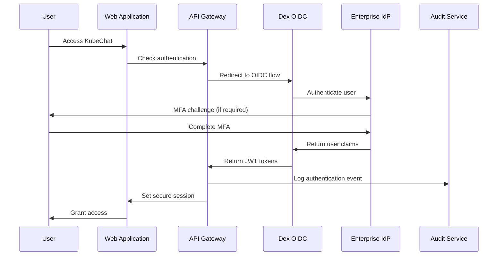

# Security Architecture

## Introduction

This document defines the comprehensive security architecture for KubeChat, covering authentication, authorization, data protection, network security, and compliance frameworks. All security controls are designed to meet enterprise requirements and regulatory standards.

### Security Principles
- **Zero Trust Architecture** - Never trust, always verify
- **Defense in Depth** - Multiple security layers
- **Principle of Least Privilege** - Minimal required access
- **Security by Design** - Security built into architecture
- **Compliance First** - SOC 2, HIPAA, FedRAMP ready

### Change Log
| Date | Version | Description | Author |
|------|---------|-------------|---------|
| 2025-09-05 | 1.0 | Initial security architecture | Winston (Architect) |

---

## Authentication Architecture

### Identity Provider Integration
```yaml
authentication_flow:
  primary_method: "OIDC (OpenID Connect)"
  fallback_method: "SAML 2.0"
  
  supported_providers:
    - "Active Directory (via OIDC)"
    - "Okta"
    - "Auth0" 
    - "Google Workspace"
    - "Azure AD"
    - "ADFS (via SAML)"
    
  token_management:
    access_token_ttl: "8 hours"
    refresh_token_ttl: "7 days"
    token_rotation: "enabled"
    token_encryption: "AES-256-GCM"
```

### Authentication Flow


### Multi-Factor Authentication
```go
// MFA enforcement configuration
type MFAConfig struct {
    Enabled          bool                    `yaml:"enabled"`
    RequiredForRoles []string               `yaml:"required_for_roles"`
    Methods          []MFAMethod            `yaml:"methods"`
    GracePeriod      time.Duration          `yaml:"grace_period"`
    RememberDevice   time.Duration          `yaml:"remember_device"`
}

type MFAMethod struct {
    Type     string `yaml:"type"`     // totp, sms, push, webauthn
    Required bool   `yaml:"required"`
    Provider string `yaml:"provider"` // okta, duo, authenticator
}

// Example configuration
mfa_config:
  enabled: true
  required_for_roles: ["admin", "operator"]
  methods:
    - type: "totp"
      required: true
      provider: "authenticator"
    - type: "webauthn"
      required: false
      provider: "built-in"
  grace_period: "4h"
  remember_device: "30d"
```

---

## Authorization Architecture

### Role-Based Access Control (RBAC)
```yaml
rbac_model:
  roles:
    viewer:
      permissions:
        - "chat:read"
        - "sessions:read"
        - "commands:read"
      kubernetes_groups: ["kubechat:viewers"]
      
    operator:
      permissions:
        - "chat:read"
        - "chat:write" 
        - "sessions:read"
        - "sessions:write"
        - "commands:read"
        - "commands:execute"
        - "audit:read"
      kubernetes_groups: ["kubechat:operators"]
      
    admin:
      permissions:
        - "*"
      kubernetes_groups: ["kubechat:admins", "system:masters"]
      
  permission_inheritance: true
  kubernetes_rbac_sync: true
```

### Kubernetes RBAC Integration
```yaml
# ClusterRole for KubeChat operators
apiVersion: rbac.authorization.k8s.io/v1
kind: ClusterRole
metadata:
  name: kubechat-operator
rules:
- apiGroups: [""]
  resources: ["pods", "services", "configmaps", "secrets"]
  verbs: ["get", "list", "watch", "create", "update", "patch", "delete"]
- apiGroups: ["apps"]
  resources: ["deployments", "replicasets", "statefulsets"]
  verbs: ["get", "list", "watch", "create", "update", "patch", "delete"]
- apiGroups: ["networking.k8s.io"]
  resources: ["ingresses", "networkpolicies"]
  verbs: ["get", "list", "watch", "create", "update", "patch"]
---
# ClusterRole for KubeChat viewers (read-only)
apiVersion: rbac.authorization.k8s.io/v1
kind: ClusterRole
metadata:
  name: kubechat-viewer
rules:
- apiGroups: [""]
  resources: ["pods", "services", "configmaps", "events"]
  verbs: ["get", "list", "watch"]
- apiGroups: ["apps"]
  resources: ["deployments", "replicasets", "statefulsets"]
  verbs: ["get", "list", "watch"]
```

### Command Authorization
```go
type CommandAuthorizationService struct {
    rbacClient kubernetes.Interface
    logger     logr.Logger
}

func (c *CommandAuthorizationService) AuthorizeCommand(
    ctx context.Context,
    user *User,
    command *KubernetesCommand,
) error {
    // 1. Check user role permissions
    if !c.hasPermission(user, command.Operation) {
        return fmt.Errorf("insufficient role permissions for %s", command.Operation)
    }
    
    // 2. Check Kubernetes RBAC
    allowed, err := c.checkKubernetesRBAC(ctx, user, command)
    if err != nil {
        return fmt.Errorf("RBAC check failed: %w", err)
    }
    if !allowed {
        return fmt.Errorf("Kubernetes RBAC denies access to %s/%s", 
            command.ResourceType, command.ResourceName)
    }
    
    // 3. Check command safety policies
    if command.RiskLevel == "DESTRUCTIVE" && !c.hasDestructivePermission(user) {
        return fmt.Errorf("destructive commands require admin role")
    }
    
    return nil
}
```

---

## Data Protection

### Encryption Standards
```yaml
encryption_requirements:
  data_in_transit:
    protocol: "TLS 1.3"
    cipher_suites:
      - "TLS_AES_256_GCM_SHA384"
      - "TLS_CHACHA20_POLY1305_SHA256"
      - "TLS_AES_128_GCM_SHA256"
    certificate_authority: "Let's Encrypt or Enterprise CA"
    
  data_at_rest:
    algorithm: "AES-256-GCM"
    key_management: "External Secrets Operator + HashiCorp Vault"
    database_encryption: "PostgreSQL TDE (Transparent Data Encryption)"
    volume_encryption: "Longhorn encrypted volumes"
    
  secrets_management:
    provider: "External Secrets Operator"
    backends:
      - "HashiCorp Vault"
      - "AWS Secrets Manager"
      - "Azure Key Vault"
      - "GCP Secret Manager"
```

### Audit Trail Protection
```go
// Tamper-proof audit logging with cryptographic integrity
type AuditEvent struct {
    ID          string                 `json:"id"`
    UserID      string                 `json:"user_id"`
    Action      string                 `json:"action"`
    Timestamp   time.Time             `json:"timestamp"`
    Metadata    map[string]interface{} `json:"metadata"`
    Checksum    string                 `json:"checksum"`    // SHA-256 hash
    Signature   string                 `json:"signature"`   // Digital signature
    PreviousHash string                `json:"previous_hash"` // Blockchain-style linking
}

func (a *AuditService) CreateEvent(ctx context.Context, event *AuditEvent) error {
    // Generate cryptographic checksum
    event.Checksum = a.generateChecksum(event)
    
    // Digital signature for non-repudiation
    signature, err := a.signEvent(event)
    if err != nil {
        return fmt.Errorf("failed to sign audit event: %w", err)
    }
    event.Signature = signature
    
    // Link to previous event (blockchain-style integrity)
    previousEvent, err := a.getLastEvent(ctx)
    if err == nil && previousEvent != nil {
        event.PreviousHash = previousEvent.Checksum
    }
    
    // Store with atomic transaction
    return a.repository.StoreEvent(ctx, event)
}
```

### Personal Data Protection (GDPR/CCPA)
```yaml
privacy_controls:
  data_classification:
    - type: "personal_identifiable_information"
      fields: ["email", "name", "ip_address"]
      retention: "7 years"
      encryption: "required"
      
    - type: "session_data"
      fields: ["chat_messages", "commands"]
      retention: "1 year"
      encryption: "required"
      anonymization: "after_retention"
      
  data_subject_rights:
    - "right_to_access"      # API to export user data
    - "right_to_rectification" # API to update user data
    - "right_to_erasure"     # API to delete user data
    - "right_to_portability" # Export in machine-readable format
    - "right_to_restriction" # Suspend data processing
```

---

## Network Security

### Service Mesh Security (Istio)
```yaml
# Istio security configuration
apiVersion: security.istio.io/v1beta1
kind: PeerAuthentication
metadata:
  name: kubechat-mtls
  namespace: kubechat-system
spec:
  mtls:
    mode: STRICT  # Enforce mutual TLS for all communication
---
apiVersion: security.istio.io/v1beta1
kind: AuthorizationPolicy
metadata:
  name: kubechat-authz
  namespace: kubechat-system
spec:
  rules:
  - from:
    - source:
        principals: ["cluster.local/ns/kubechat-system/sa/api-gateway"]
    to:
    - operation:
        methods: ["POST"]
        paths: ["/api/v1/nlp/process"]
  - from:
    - source:
        principals: ["cluster.local/ns/kubechat-system/sa/audit-service"]
    to:
    - operation:
        methods: ["POST", "GET"]
        paths: ["/api/v1/audit/*"]
```

### Network Policies
```yaml
# Deny all ingress by default
apiVersion: networking.k8s.io/v1
kind: NetworkPolicy
metadata:
  name: deny-all-ingress
  namespace: kubechat-system
spec:
  podSelector: {}
  policyTypes:
  - Ingress
---
# Allow specific service communication
apiVersion: networking.k8s.io/v1
kind: NetworkPolicy
metadata:
  name: api-gateway-policy
  namespace: kubechat-system
spec:
  podSelector:
    matchLabels:
      app: api-gateway
  policyTypes:
  - Ingress
  - Egress
  ingress:
  - from:
    - namespaceSelector:
        matchLabels:
          name: ingress-nginx
    ports:
    - protocol: TCP
      port: 8080
  egress:
  - to:
    - podSelector:
        matchLabels:
          app: nlp-service
    ports:
    - protocol: TCP
      port: 8081
  - to:
    - podSelector:
        matchLabels:
          app: audit-service
    ports:
    - protocol: TCP
      port: 8082
```

### Web Application Security
```typescript
// Content Security Policy configuration
const cspConfig = {
  directives: {
    defaultSrc: ["'self'"],
    scriptSrc: [
      "'self'",
      "'unsafe-inline'", // Only for development
      "https://cdnjs.cloudflare.com"
    ],
    styleSrc: [
      "'self'",
      "'unsafe-inline'", // Required for Tailwind CSS
      "https://fonts.googleapis.com"
    ],
    imgSrc: [
      "'self'",
      "data:",
      "https:"
    ],
    connectSrc: [
      "'self'",
      "wss://api.kubechat.company.com", // WebSocket endpoint
      "https://api.kubechat.company.com"
    ],
    fontSrc: [
      "'self'",
      "https://fonts.gstatic.com"
    ],
    objectSrc: ["'none'"],
    mediaSrc: ["'none'"],
    frameSrc: ["'none'"]
  }
};

// Security headers middleware
export const securityHeaders = {
  'Strict-Transport-Security': 'max-age=31536000; includeSubDomains',
  'X-Frame-Options': 'DENY',
  'X-Content-Type-Options': 'nosniff',
  'X-XSS-Protection': '1; mode=block',
  'Referrer-Policy': 'strict-origin-when-cross-origin',
  'Permissions-Policy': 'geolocation=(), microphone=(), camera=()'
};
```

---

## Security Monitoring and Incident Response

### Security Information and Event Management (SIEM)
```yaml
siem_integration:
  log_forwarding:
    - source: "audit-service"
      destination: "enterprise-siem"
      format: "CEF (Common Event Format)"
      frequency: "real-time"
      
    - source: "authentication-events"
      destination: "security-operations-center"
      format: "JSON"
      frequency: "real-time"
      
  security_events:
    - "failed_authentication_attempts"
    - "privilege_escalation_attempts"
    - "suspicious_command_patterns"
    - "unauthorized_api_access"
    - "data_export_activities"
    
  alerting_rules:
    - condition: "failed_auth_attempts > 5 in 5m"
      severity: "high"
      action: "block_ip_temporary"
      
    - condition: "destructive_commands_without_confirmation"
      severity: "critical" 
      action: "immediate_alert"
```

### Intrusion Detection
```go
type SecurityMonitor struct {
    alerter    AlertingService
    blocklist  BlocklistService
    logger     logr.Logger
}

func (s *SecurityMonitor) MonitorSecurityEvents(ctx context.Context) {
    // Monitor for suspicious patterns
    go s.monitorAuthenticationAnomalies(ctx)
    go s.monitorCommandPatterns(ctx)
    go s.monitorAPIAbusePatterns(ctx)
}

func (s *SecurityMonitor) monitorAuthenticationAnomalies(ctx context.Context) {
    for event := range s.authEventChannel {
        // Detect brute force attacks
        if s.detectBruteForce(event) {
            s.alerter.SendAlert(SecurityAlert{
                Type:     "brute_force_detected",
                Severity: "high",
                Source:   event.IPAddress,
                Details:  "Multiple failed authentication attempts detected",
            })
            
            // Temporarily block IP
            s.blocklist.BlockIP(event.IPAddress, 15*time.Minute)
        }
        
        // Detect impossible travel (geolocation-based)
        if s.detectImpossibleTravel(event) {
            s.alerter.SendAlert(SecurityAlert{
                Type:     "impossible_travel",
                Severity: "critical",
                UserID:   event.UserID,
                Details:  "User login from impossible geographic location",
            })
        }
    }
}
```

### Incident Response Procedures
```yaml
incident_response:
  severity_levels:
    p0_critical:
      - "active_security_breach"
      - "data_exfiltration_detected" 
      - "privilege_escalation_successful"
      response_time: "< 15 minutes"
      
    p1_high:
      - "authentication_bypass_attempt"
      - "suspicious_admin_activity"
      - "unauthorized_api_access"
      response_time: "< 1 hour"
      
  automated_responses:
    - trigger: "brute_force_attack"
      action: "block_source_ip"
      duration: "1 hour"
      
    - trigger: "malicious_command_pattern"
      action: "suspend_user_session"
      duration: "until_investigation"
      
    - trigger: "data_export_anomaly"
      action: "alert_security_team"
      escalation: "immediate"
```

---

## Compliance Frameworks

### SOC 2 Type II Compliance
```yaml
soc2_controls:
  security_principle:
    cc6_1: "logical_access_controls"
      implementation: "RBAC + Kubernetes RBAC integration"
      evidence: "User access reviews, RBAC audit logs"
      
    cc6_2: "authentication_credentials"
      implementation: "Enterprise OIDC + MFA enforcement"
      evidence: "MFA enrollment reports, authentication logs"
      
    cc6_3: "network_segmentation"
      implementation: "Istio service mesh + NetworkPolicies"
      evidence: "Network topology documentation, traffic analysis"
      
  availability_principle:
    a1_1: "availability_monitoring"
      implementation: "Prometheus alerting + SLO monitoring"
      evidence: "Uptime reports, incident response logs"
      
    a1_2: "system_recovery"
      implementation: "Velero backup + disaster recovery procedures"
      evidence: "Recovery time testing, backup verification"
```

### HIPAA Technical Safeguards (Healthcare Deployments)
```yaml
hipaa_technical_safeguards:
  access_control:
    164_312_a_1: "unique_user_identification"
      implementation: "Enterprise SSO with unique user identifiers"
      
    164_312_a_2_i: "automatic_logoff"
      implementation: "Session timeout after inactivity"
      
    164_312_a_2_ii: "encryption_decryption"
      implementation: "AES-256 encryption for all PHI data"
      
  audit_controls:
    164_312_b: "audit_logs"
      implementation: "Comprehensive audit logging with integrity protection"
      evidence: "Audit log exports, integrity verification reports"
      
  integrity:
    164_312_c_1: "phi_alteration_destruction"
      implementation: "Immutable audit logs + cryptographic checksums"
      
  person_authentication:
    164_312_d: "person_authentication"
      implementation: "MFA + certificate-based authentication"
      
  transmission_security:
    164_312_e_1: "integrity_controls"
      implementation: "TLS 1.3 + message authentication codes"
      
    164_312_e_2_ii: "encryption"
      implementation: "End-to-end encryption for all data transmission"
```

### FedRAMP Controls (Government Deployments)
```yaml
fedramp_controls:
  access_control:
    ac_2: "account_management"
      implementation: "Automated user lifecycle management via OIDC"
      
    ac_3: "access_enforcement"
      implementation: "RBAC + attribute-based access control"
      
  audit_accountability:
    au_2: "audit_events"
      implementation: "Comprehensive security event logging"
      
    au_3: "content_of_audit_records"
      implementation: "Structured audit logs with required data elements"
      
  identification_authentication:
    ia_2: "identification_authentication"
      implementation: "PKI certificates + MFA"
      
    ia_5: "authenticator_management"
      implementation: "Automated certificate lifecycle management"
```

---

## Security Testing and Validation

### Penetration Testing Requirements
```yaml
penetration_testing:
  frequency: "quarterly"
  scope:
    - "web_application_security"
    - "api_security_testing"
    - "kubernetes_security_assessment"
    - "network_penetration_testing"
    - "social_engineering_resistance"
    
  methodologies:
    - "OWASP Testing Guide"
    - "NIST SP 800-115"
    - "PTES (Penetration Testing Execution Standard)"
    
  automated_testing:
    - tool: "OWASP ZAP"
      frequency: "weekly"
      scope: "web_application"
      
    - tool: "kube-hunter"
      frequency: "daily"
      scope: "kubernetes_cluster"
      
    - tool: "Nuclei"
      frequency: "daily" 
      scope: "infrastructure_vulnerabilities"
```

### Security Code Review
```go
// Security-focused code review checklist
type SecurityReviewChecklist struct {
    InputValidation     bool `yaml:"input_validation"`
    OutputEncoding      bool `yaml:"output_encoding"`
    AuthenticationCheck bool `yaml:"authentication_check"`
    AuthorizationCheck  bool `yaml:"authorization_check"`
    ErrorHandling       bool `yaml:"error_handling"`
    SecretManagement    bool `yaml:"secret_management"`
    SQLInjectionPrevention bool `yaml:"sql_injection_prevention"`
    XSSPrevention       bool `yaml:"xss_prevention"`
    CSRFProtection      bool `yaml:"csrf_protection"`
    SecurityHeaders     bool `yaml:"security_headers"`
}

// Automated security scanning in CI/CD
security_pipeline:
  static_analysis:
    - tool: "gosec"
      language: "go"
      fail_on: "high_severity"
      
    - tool: "semgrep"
      language: "typescript"
      rules: "security"
      
  dependency_scanning:
    - tool: "nancy"
      language: "go"
      
    - tool: "audit"
      language: "javascript"
      
  container_scanning:
    - tool: "trivy"
      scope: "container_images"
      fail_on: "critical"
```

---

## Conclusion

This security architecture provides comprehensive protection for KubeChat deployments across all enterprise environments. The layered security approach ensures robust defense against modern threats while maintaining compliance with regulatory requirements.

**Security Assurance:**
- ✅ **Zero Trust Architecture** with mutual TLS and strict RBAC
- ✅ **Enterprise Integration** with OIDC/SAML and MFA support
- ✅ **Comprehensive Monitoring** with SIEM integration and automated response
- ✅ **Regulatory Compliance** with SOC 2, HIPAA, and FedRAMP controls
- ✅ **Continuous Validation** through automated testing and monitoring

**Next Steps:**
1. Implement security controls during deployment
2. Configure SIEM integration and alerting rules
3. Conduct initial security assessment
4. Establish incident response procedures
5. Schedule regular security reviews and updates