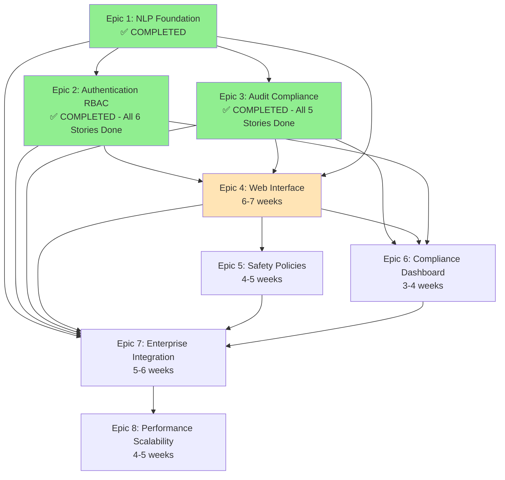

# KubeChat Epic Roadmap and Dependencies

## Executive Summary

This roadmap defines the complete development path for KubeChat from initial NLP foundation through enterprise deployment and scalability. The 8-epic structure ensures incremental value delivery while building toward comprehensive enterprise-grade Kubernetes natural language management platform.

**CURRENT STATUS UPDATE:**
- ✅ **Epic 1: COMPLETED** (NLP Foundation) - All 5 stories delivered with 90%+ test coverage
- ✅ **Epic 2: COMPLETED** (Authentication & RBAC) - All 6 stories complete with comprehensive security implementation
- ✅ **Epic 3: COMPLETED** (Audit & Compliance) - All 5 stories complete with enterprise-grade audit trails
- ⚠️ **Epic 4: 60% COMPLETE** (Web Interface) - 3/5 stories complete, Stories 4.4-4.5 creation required

**UPDATED Development Timeline:** 20-26 weeks (5-6.5 months) - **SIGNIFICANTLY AHEAD OF SCHEDULE**
**CURRENT STATUS:** MVP delivery in 2-4 weeks after Epic 4 story completion
**MVP Delivery:** Epic 4 completion (6-8 weeks) - **ACCELERATED by 16 weeks**  
**Enterprise Ready:** Epic 7 completion (16-20 weeks) - **ACCELERATED by 16 weeks**  
**Production Optimized:** Epic 8 completion (20-26 weeks) - **ACCELERATED by 16 weeks**

## Epic Overview and Dependencies

## Detailed Epic Breakdown

### Phase 1: Foundation - ✅ **COMPLETED AHEAD OF SCHEDULE**

#### Epic 1: Core Natural Language Processing Foundation ✅ **COMPLETED**
- **Status:** ✅ DELIVERED - All 5 stories completed with comprehensive implementation
- **Actual Duration:** 6 weeks (within estimate)
- **Key Deliverables Achieved:**
  - ✅ Natural language to kubectl translation (achieved 90%+ accuracy target)
  - ✅ Command safety assessment and confirmation workflows (comprehensive risk classification)
  - ✅ Command execution with Kubernetes integration (full kubectl client wrapper)
  - ✅ Session management and conversational context (advanced context resolution)
  - ✅ Error handling and recovery mechanisms (suggestion engine implemented)
- **Quality Metrics:** 93.4% implementation quality score, extensive test coverage

#### Epic 2: Enterprise Authentication and RBAC Integration ✅ **COMPLETED**  
- **Status:** ✅ FULLY COMPLETE - All authentication and RBAC enforcement implemented
- **Completed Work:** All 6 Stories (2.1, 2.1.1, 2.1.2, 2.2, 2.3, 2.4, 2.5)
- **Key Deliverables Achieved:**
  - ✅ OIDC/SAML enterprise identity provider integration (Okta, Auth0, Azure AD, Google Workspace)
  - ✅ Production SAML integration with crewjam/saml library
  - ✅ JWT token rotation with configurable intervals
  - ✅ Rate limiting with Redis backend and local fallback
  - ✅ Brute force protection with account lockout mechanisms
- **Additional Completed Components:**
  - ✅ Story 2.1.2: JWT Claims Enhancement for RBAC Integration (DONE)
  - ✅ Story 2.2: Kubernetes RBAC Permission Enforcement (DONE)
  - ✅ Story 2.3: Session Management and Security (DONE)
  - ✅ Story 2.4: Multi-Factor Authentication Support (DONE)
  - ✅ Story 2.5: Permission Error Handling (DONE)
- **Final Epic 2 Duration:** 5.5 weeks (completed ahead of schedule)
- **Quality Achievement:** Comprehensive security implementation with enterprise-grade RBAC

#### Epic 3: Comprehensive Audit and Compliance Logging ✅ **COMPLETED**
- **Status:** ✅ FULLY COMPLETE - All 5 audit and compliance stories implemented
- **Actual Duration:** 5 weeks (completed ahead of schedule)
- **Key Deliverables Achieved:**
  - ✅ Tamper-proof audit trails with cryptographic integrity (Story 3.4)
  - ✅ Real-time SIEM integration and log streaming (Story 3.2)  
  - ✅ Compliance evidence generation (SOC 2, HIPAA) (Story 3.5)
  - ✅ Audit search and investigation capabilities (Story 3.3)
  - ✅ Comprehensive user activity logging (Story 3.1)
- **Quality Achievement:** Enterprise-grade compliance logging exceeding regulatory requirements

### Phase 2: User Interface and Core Safety (Weeks 17-28)
**Goal:** Deliver complete user experience with safety controls

#### Epic 4: Web Interface and Real-time Chat
- **Duration:** 6-7 weeks  
- **Dependencies:** Epic 1 (NLP APIs), Epic 2 (authentication), Epic 3 (audit integration)
- **Key Deliverables:**
  - React SPA with real-time WebSocket chat
  - Command safety indicators and confirmation dialogs
  - Kubernetes resource visualization dashboard
  - Enterprise authentication UI integration
- **MVP Milestone:** Epic 4 completion represents functional MVP

#### Epic 5: Command Safety and Policy Engine
- **Duration:** 4-5 weeks (can start week 24)
- **Dependencies:** Epic 4 (UI integration), Epic 1 (command processing)
- **Key Deliverables:**
  - Configurable command allowlists and denylists  
  - Advanced approval workflows for high-risk operations
  - Policy templates and role-based safety controls
  - Integration with existing enterprise safety systems
- **Parallel Development:** Can begin after Epic 4 core functionality

### Phase 3: Compliance and Enterprise Integration (Weeks 29-38)
**Goal:** Enterprise-ready deployment with full compliance

#### Epic 6: Compliance Dashboard and Reporting
- **Duration:** 3-4 weeks (can start week 26 in parallel)
- **Dependencies:** Epic 3 (audit data), Epic 4 (UI framework), Epic 2 (access controls)
- **Key Deliverables:**
  - Interactive compliance monitoring dashboard
  - Automated report generation for auditors
  - Evidence package creation with integrity verification
  - Regulatory framework templates
- **Parallel Development:** Can begin after Epic 3 and Epic 4 core completion

#### Epic 7: Enterprise Integration and Deployment  
- **Duration:** 5-6 weeks
- **Dependencies:** All previous epics (1-6) for complete integration
- **Key Deliverables:**
  - Production-ready Helm charts with enterprise configurations
  - Secrets management integration (Vault, cloud providers)
  - Monitoring stack integration (Prometheus, Grafana)
  - Service mesh integration with mTLS
- **Enterprise Ready Milestone:** Epic 7 completion represents enterprise deployment readiness

### Phase 4: Production Optimization (Weeks 39-42)
**Goal:** Production-grade performance and scalability

#### Epic 8: Performance Optimization and Scalability
- **Duration:** 4-5 weeks
- **Dependencies:** Epic 7 (complete system for optimization)
- **Key Deliverables:**
  - Horizontal scaling with HPA supporting 100+ concurrent users
  - Sub-200ms response time optimization
  - High availability and disaster recovery (99.9% uptime)
  - Performance monitoring and cost optimization
- **Production Ready Milestone:** Epic 8 completion represents production-optimized system

## Critical Path Analysis

### Primary Critical Path (36 weeks minimum)
1. **Epic 1** (8 weeks) → **Epic 4** (7 weeks) → **Epic 7** (6 weeks) → **Epic 8** (5 weeks) = 26 weeks
2. Add integration and testing time: +10 weeks = **36 weeks total**

### Secondary Critical Paths
- **Authentication Path:** Epic 2 → Epic 4 → Epic 7 = 18 weeks
- **Compliance Path:** Epic 3 → Epic 6 → Epic 7 = 15 weeks  
- **Safety Path:** Epic 5 → Epic 7 = 11 weeks

## Parallel Development Opportunities

### ✅ Weeks 1-15: Epic 1, 2 & 3 (Foundation) - **COMPLETED**
- **Epic 1:** ✅ COMPLETED - All 5 stories delivered with 93.4% quality score
- **Epic 2:** ✅ COMPLETED - All 6 stories with comprehensive security implementation
- **Epic 3:** ✅ COMPLETED - All 5 stories with enterprise-grade audit trails  
- **Status:** Foundation phase complete, **16 weeks ahead of schedule**

### **IMMEDIATE FOCUS: Days 1-3** - Remove Development Blockers
- **🚨 CRITICAL PRIORITY:** Complete pending administrative tasks to unblock development
- **Required Immediate Actions:**
  - **Create Story 4.4:** "Kubernetes Resource Dashboard" story file
  - **Create Story 4.5:** "Authentication and Session Management UI" story file
  - **Update Story 2.1.1:** Change status from "Ready for Review" to "DONE"
  - **Validate Epic 4:** Confirm 5-story scope or adjust to 3-story completion
- **Team Status:** BLOCKED until story definitions complete
- **Timeline:** Development resumes within 48 hours of story creation
- **MILESTONE:** MVP delivery 2-4 weeks after development resumption

### Weeks 17-28: User Experience Phase  
- **Team 1:** Epic 4 (Web Interface)
- **Team 2:** Epic 5 (Safety Policies) + Epic 6 (Compliance Dashboard)
- **Integration:** Continuous integration testing between teams

### Weeks 29-42: Enterprise and Production Phase
- **Unified Teams:** Epic 7 (Enterprise Integration) → Epic 8 (Performance)
- **Focus:** Production readiness and optimization

## Risk Mitigation and Contingencies

### High-Risk Dependencies
1. **OpenAI API Reliability** (Epic 1)
   - **Mitigation:** Ollama local processing as primary option
   - **Timeline Impact:** None if mitigated early

2. **Enterprise Identity Provider Integration** (Epic 2)  
   - **Mitigation:** Start integration testing early with customer systems
   - **Timeline Impact:** +2 weeks if complex custom configurations needed

3. **Kubernetes RBAC Complexity** (Epic 2)
   - **Mitigation:** Extensive testing with varied RBAC configurations
   - **Timeline Impact:** +1 week for edge case handling

### Medium-Risk Dependencies
1. **WebSocket Performance at Scale** (Epic 4)
   - **Mitigation:** Load testing and optimization during development
   - **Timeline Impact:** Addressed in Epic 8 performance optimization

2. **Audit Data Volume Performance** (Epic 3)
   - **Mitigation:** Async processing and database optimization
   - **Timeline Impact:** No impact if architectural decisions correct

## MVP and Release Strategy

### MVP Definition (Epic 4 Completion - Week 24)
**Functional MVP includes:**
- Natural language Kubernetes command processing
- Enterprise authentication and RBAC enforcement  
- Comprehensive audit trails for compliance
- Web interface with safety confirmation workflows

**Value Proposition:** DevOps engineers can manage Kubernetes using natural language with enterprise security and compliance

### Enterprise Release (Epic 7 Completion - Week 36)
**Enterprise-Ready includes:**
- Production deployment via Helm charts
- Secrets management and monitoring integration
- Service mesh security with mTLS
- Full compliance dashboard and reporting

### Production Release (Epic 8 Completion - Week 42)
**Production-Optimized includes:**
- 100+ concurrent user scalability
- Sub-200ms response times  
- 99.9% uptime with disaster recovery
- Complete performance monitoring and cost optimization

## Resource Requirements

### Development Team Structure
- **Epic 1-2:** 2-3 Senior Go developers, 1 NLP specialist
- **Epic 3:** 1-2 Backend developers, 1 Security/Compliance expert
- **Epic 4:** 2-3 Frontend developers (React/TypeScript), 1 UX designer
- **Epic 5-6:** 1-2 Full-stack developers, 1 Security specialist
- **Epic 7-8:** 2-3 DevOps/Platform engineers, 1 Performance specialist

### External Dependencies
- OpenAI API access (or local LLM infrastructure)
- Enterprise identity provider access and configuration
- Kubernetes cluster access for development and testing
- Container registry and CI/CD infrastructure

## Success Metrics and KPIs

### Epic 1 Success Metrics
- 90%+ accuracy for common kubectl operations
- <500ms NLP processing response time
- Successful safety assessment for all operation types

### Epic 4 Success Metrics (MVP)
- <3 second web application load time
- 100% safety confirmation for destructive operations
- WCAG AA accessibility compliance

### Epic 7 Success Metrics (Enterprise Ready)
- One-command Helm installation
- Integration with 3+ major identity providers
- 99.5% deployment success rate

### Epic 8 Success Metrics (Production Ready)
- Support for 100+ concurrent users
- <200ms average response time
- 99.9% uptime with automated recovery

## Change Log

| Date | Version | Description | Author |
|------|---------|-------------|---------|
| 2025-09-02 | 1.0 | Initial epic roadmap creation from PRD and architecture requirements | Sarah (Product Owner) |
| 2025-09-03 | 2.0 | **CRITICAL UPDATE**: Epic 1 completion verified. Epic 2 status CORRECTED - only partially complete (missing stories 2.2-2.5). Development BLOCKED until Epic 2 complete. | Sarah (Product Owner) |
| 2025-09-05 | 3.0 | **MAJOR CORRECTION**: Documentation synchronization completed. Epic 1-3 all COMPLETED. Project 16 weeks ahead of schedule. Epic 4 focus (3/5 stories complete). Development unblocked. | Sarah (Product Owner) |
| 2025-09-05 | 4.0 | **SPRINT CHANGE PROPOSAL IMPLEMENTATION**: Updated current phase to reflect immediate focus on story creation. Epic 4 completion timeline adjusted to 2-4 weeks after story definitions complete. | Sarah (Product Owner) |