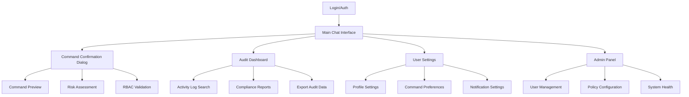
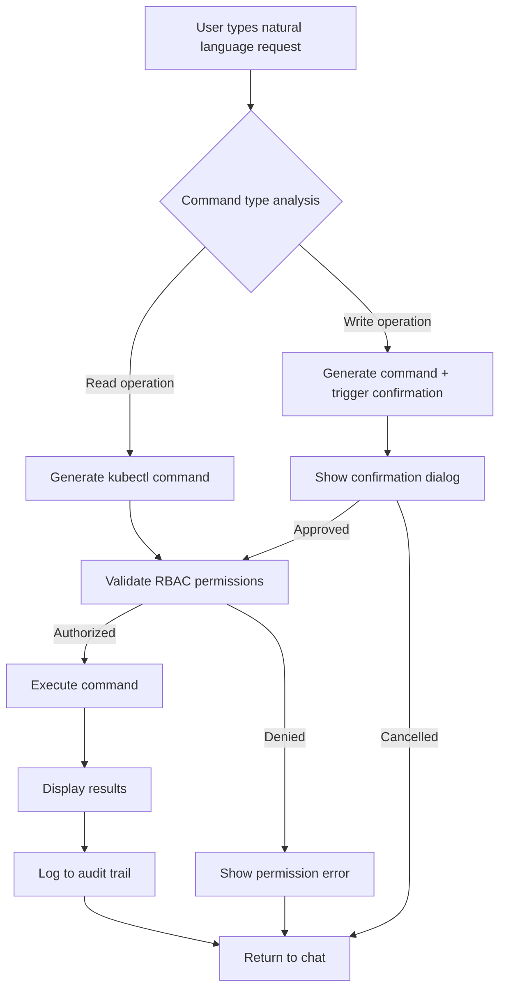
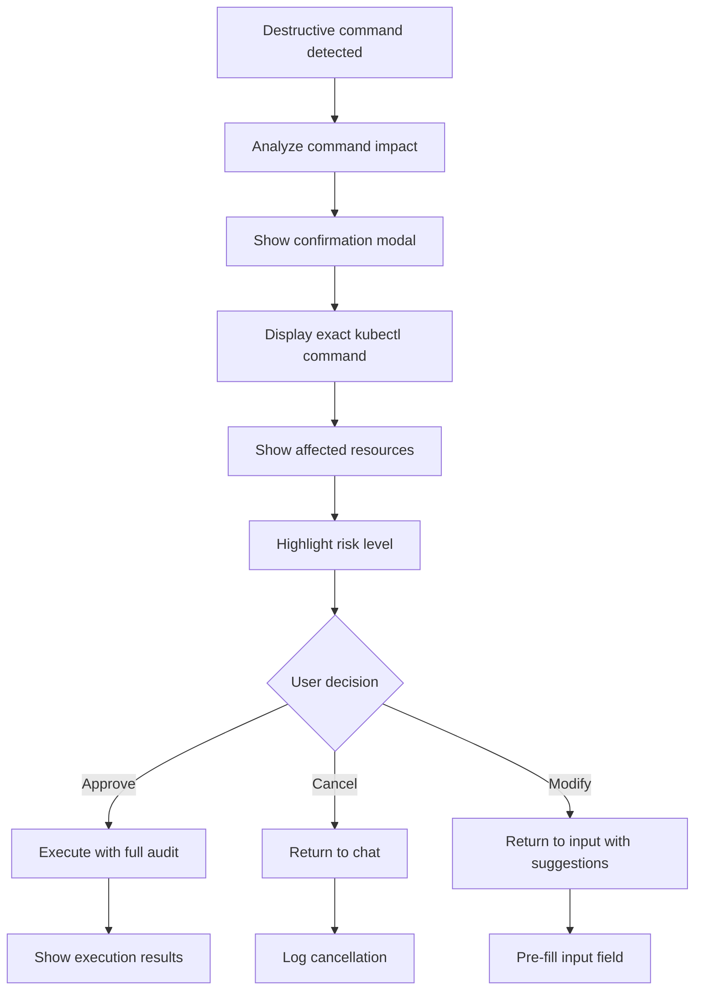
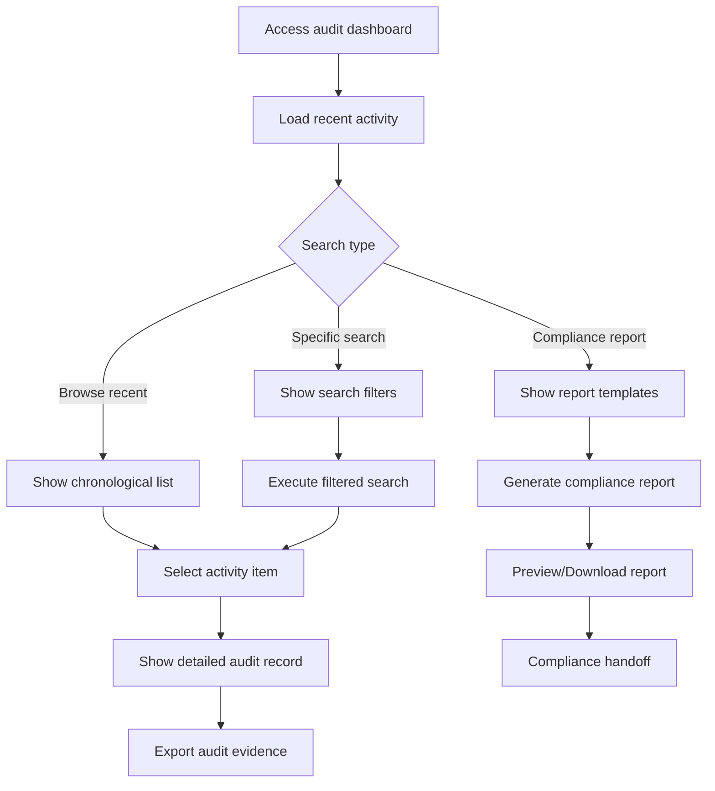

# KubeChat UI/UX Specification

## Introduction

This document defines the user experience goals, information architecture, user flows, and visual design specifications for KubeChat's user interface. It serves as the foundation for visual design and frontend development, ensuring a cohesive and user-centered experience.

### Overall UX Goals & Principles

#### Target User Personas
- **Enterprise DevOps Engineer:** Technical professionals managing production Kubernetes clusters in regulated environments who need both operational efficiency and comprehensive audit trails
- **Compliance-Conscious Administrator:** Security-focused team leads who require visibility, control, and evidence generation for regulatory compliance
- **Junior Engineer:** Less experienced team members who need safety guardrails and clear guidance to perform cluster operations confidently

#### Usability Goals
- **Safety First:** Zero tolerance for accidental destructive operations - all write actions require explicit confirmation with clear risk indicators
- **Enterprise Trust:** Professional, reliable interface that conveys security and precision appropriate for production environments
- **Conversational Ease:** Natural language interaction feels as intuitive as consumer messaging while maintaining enterprise standards
- **Compliance Transparency:** Audit trails and evidence generation are visible and accessible throughout the user experience
- **Accessibility Compliance:** WCAG AA conformance ensures usability for all team members regardless of abilities

#### Design Principles
1. **Clarity over Cleverness** - Every interface element serves a clear purpose with no ambiguous interactions
2. **Safety Through Confirmation** - Destructive operations require explicit user confirmation with visual risk indicators  
3. **Progressive Trust** - Build user confidence through consistent feedback and transparent system behavior
4. **Regulatory Readiness** - Design compliance capabilities as first-class features, not afterthoughts
5. **Professional Accessibility** - Ensure all functionality works seamlessly with assistive technologies and enterprise accessibility requirements

### Change Log
| Date | Version | Description | Author |
|------|---------|-------------|--------|
| 2025-09-02 | 1.0 | Initial UI/UX specification creation | Sally (UX Expert) |

## Information Architecture (IA)

### Site Map / Screen Inventory

### Navigation Structure

**Primary Navigation:** Single-screen chat interface with contextual panels that slide in from the right side. Primary actions (chat, audit, settings) accessible via icon buttons in the left sidebar, maintaining focus on the conversational experience.

**Secondary Navigation:** Context-sensitive menus within each major section. Command confirmation dialogs overlay the main interface. Audit dashboard and settings open as slide-out panels to preserve chat context.

**Breadcrumb Strategy:** Minimal breadcrumbs only within admin sections and deep audit searches. Primary chat interface maintains conversational flow without traditional navigation patterns.

## User Flows

### Natural Language Command Execution Flow

**User Goal:** Execute Kubernetes operations through natural language without memorizing kubectl syntax

**Entry Points:** Main chat interface message input field, voice input (future), quick action buttons

**Success Criteria:** Command is successfully translated, validated against RBAC, executed, and results displayed with full audit trail

#### Flow Diagram

#### Edge Cases & Error Handling:
- **Ambiguous natural language**: System requests clarification with suggested interpretations
- **Network connectivity issues**: Graceful degradation with clear error messages and retry options
- **RBAC permission denied**: Clear explanation of required permissions with request escalation option
- **Command execution failures**: Detailed kubectl error interpretation with suggested remediation steps
- **Session timeout during execution**: Automatic re-authentication prompt with command state preservation

**Notes:** This flow emphasizes safety through confirmation and transparency through clear feedback at each step.

### Command Safety Confirmation Flow

**User Goal:** Understand the exact impact of write operations before execution to prevent accidental cluster modifications

**Entry Points:** Any natural language request that translates to write/destructive kubectl operations

**Success Criteria:** User clearly understands the operation impact and makes informed decision to proceed or cancel

#### Flow Diagram

#### Edge Cases & Error Handling:
- **Complex multi-resource operations**: Break down impact into clear resource-by-resource explanations
- **Cascading delete operations**: Warn about dependent resources that will be affected
- **Irreversible operations**: Extra confirmation step with typed confirmation phrase
- **Production environment detection**: Enhanced warnings and additional approval requirements
- **Insufficient preview information**: Fall back to command preview with risk level indicators

**Notes:** This flow implements the safety-first principle with progressive disclosure of risk information.

### Compliance Audit Access Flow

**User Goal:** Access audit trails and compliance evidence for regulatory requirements and incident investigation

**Entry Points:** Audit dashboard icon, compliance reports menu, incident investigation links

**Success Criteria:** User finds relevant audit information and can export evidence in required format

#### Flow Diagram

#### Edge Cases & Error Handling:
- **Large result sets**: Pagination with performance optimization and progressive loading
- **Missing audit data**: Clear indicators of data retention limits with escalation paths
- **Export format requirements**: Multiple export options (PDF, CSV, JSON) with format validation
- **Access permission issues**: Clear separation between user audit data and admin-level compliance reports
- **Concurrent user sessions**: Real-time updates to audit logs with conflict resolution

**Notes:** This flow treats compliance as a first-class citizen with professional tooling for regulatory evidence.

## Wireframes & Mockups

**Primary Design Files:** Design mockups will be created in Figma with a link to be provided for the complete visual design system and interactive prototypes.

### Main Chat Interface

**Purpose:** Primary interaction point for natural language Kubernetes management with enterprise-grade professional appearance

**Key Elements:**
- **Left Sidebar (60px):** Vertical navigation with icons for Chat (active), Audit Dashboard, Settings, and Admin Panel (role-based)
- **Chat Area (flexible):** Conversational message history with clear distinction between user messages, system responses, and command outputs
- **Input Area (bottom):** Natural language input field with send button, typing indicators, and safety status indicator
- **Status Bar (top):** Current cluster context, user identity, session status, and connection indicator
- **Safety Color System:** Green borders for safe operations, amber for caution, red for destructive actions

**Interaction Notes:** WebSocket real-time messaging with optimistic UI updates. Command outputs include collapsible sections for detailed results. Context-sensitive help appears inline.

**Design File Reference:** [Figma Frame: Main Chat Interface]

### Command Confirmation Dialog

**Purpose:** Safety-critical modal that prevents accidental destructive operations through clear risk communication

**Key Elements:**
- **Modal Overlay:** Semi-transparent backdrop that focuses attention on confirmation dialog
- **Risk Level Banner:** Color-coded header (red for destructive, amber for caution) with clear risk assessment
- **Command Preview:** Exact kubectl command display with syntax highlighting and explanation
- **Impact Summary:** Affected resources, scope of changes, and potential consequences
- **Action Buttons:** "Cancel" (secondary), "Execute" (primary with risk-appropriate color), "Modify Request" (tertiary)
- **Audit Notice:** Clear indication that action will be logged for compliance

**Interaction Notes:** Modal cannot be dismissed by clicking outside. Tab navigation respects dialog boundaries. Screen reader announces risk level immediately.

**Design File Reference:** [Figma Frame: Command Confirmation Variants]

### Compliance Dashboard

**Purpose:** Professional audit trail interface for regulatory compliance and incident investigation

**Key Elements:**
- **Slide-out Panel:** Right-side panel that preserves chat context while providing full audit functionality
- **Filter Controls:** Date range picker, user filter, operation type filter, and free-text search
- **Activity Timeline:** Chronological list of all operations with expandable details
- **Export Controls:** One-click export to PDF, CSV, JSON with compliance formatting
- **Compliance Metrics:** Summary cards showing activity counts, user statistics, and risk indicators
- **Search Results:** Tabular view with sortable columns and detailed drill-down capabilities

**Interaction Notes:** Virtualized scrolling for large result sets. Real-time updates with subtle notifications. Keyboard shortcuts for power users.

**Design File Reference:** [Figma Frame: Compliance Dashboard]

## Component Library / Design System

**Design System Approach:** Create a custom component library tailored for enterprise Kubernetes management with built-in accessibility, safety indicators, and compliance-ready patterns. Components follow atomic design principles with a focus on consistency, safety, and professional trust-building.

### Safety Status Indicator

**Purpose:** Universal visual language for communicating operation risk levels across all interfaces

**Variants:**
- **Safe (Green):** Read operations, successful completions, authorized actions
- **Caution (Amber):** Write operations requiring attention, warnings, pending approvals  
- **Destructive (Red):** Delete operations, irreversible actions, critical errors
- **Info (Blue):** System messages, informational content, neutral states

**States:** Normal, hover, active, disabled, loading

**Usage Guidelines:** Always pair color indicators with text labels and icons for accessibility. Use consistent placement (left border, background tint, or icon) across all components.

### Command Message Bubble

**Purpose:** Display natural language requests and system responses in conversational format

**Variants:**
- **User Message:** Right-aligned, blue background, rounded corners
- **System Response:** Left-aligned, gray background, includes safety indicator
- **Command Output:** Monospace font, syntax highlighting, collapsible sections
- **Error Message:** Red accent, clear error explanation with remediation suggestions

**States:** Sending, delivered, processing, completed, failed

**Usage Guidelines:** Include timestamp, user identity, and audit trail indicators. Support rich content including code blocks, tables, and interactive elements.

### Confirmation Modal

**Purpose:** Critical safety component for destructive operation confirmation

**Variants:**
- **Standard Confirmation:** Basic approval/cancel with command preview
- **High-Risk Confirmation:** Additional typed confirmation phrase required
- **Multi-Step Confirmation:** Progressive disclosure for complex operations

**States:** Loading, ready for input, validating input, executing

**Usage Guidelines:** Modal must capture focus, prevent dismissal by outside click, and provide clear escape mechanisms. Risk level must be immediately apparent through color and typography.

### Audit Data Table

**Purpose:** Professional display of compliance data with enterprise-grade functionality

**Variants:**
- **Timeline View:** Chronological display with expandable details
- **Tabular View:** Sortable columns with filtering and search
- **Summary Cards:** Key metrics and status indicators

**States:** Loading, populated, empty state, error state

**Usage Guidelines:** Support keyboard navigation, screen reader compatibility, and export functionality. Include clear data hierarchy and progressive disclosure patterns.

## Branding & Style Guide

### Visual Identity
**Brand Guidelines:** Professional enterprise software aesthetic with security-first visual language and accessibility-compliant design standards.

### Color Palette
| Color Type | Hex Code | Usage |
|------------|----------|-------|
| Primary | #2563eb | Brand elements, primary actions, user messages |
| Secondary | #64748b | Secondary actions, inactive states, borders |
| Accent | #0ea5e9 | Links, highlights, informational elements |
| Success | #059669 | Safe operations, confirmations, positive feedback |
| Warning | #d97706 | Caution states, important notices, write operations |
| Error | #dc2626 | Destructive actions, errors, critical alerts |
| Neutral | #f8fafc, #e2e8f0, #64748b, #1e293b | Text, backgrounds, borders, surfaces |

### Typography

#### Font Families
- **Primary:** Inter (system font fallback: -apple-system, BlinkMacSystemFont, "Segoe UI", Roboto)
- **Secondary:** Inter (same as primary for consistency)
- **Monospace:** Fira Code (fallback: "SF Mono", Monaco, Consolas, monospace)

#### Type Scale
| Element | Size | Weight | Line Height |
|---------|------|--------|-------------|
| H1 | 32px | 700 (Bold) | 1.25 |
| H2 | 24px | 600 (Semi-Bold) | 1.33 |
| H3 | 20px | 600 (Semi-Bold) | 1.4 |
| Body | 16px | 400 (Regular) | 1.5 |
| Small | 14px | 400 (Regular) | 1.43 |

### Iconography
**Icon Library:** Heroicons v2 (outline and solid variants) with custom Kubernetes-specific icons for cluster resources

**Usage Guidelines:** 24px standard size for interface icons, 16px for inline icons. Consistent stroke width of 1.5px for custom icons. Always include accessible labels.

### Spacing & Layout
**Grid System:** 8px base unit with 4px, 8px, 16px, 24px, 32px, 48px, 64px spacing scale

**Spacing Scale:** Consistent application of 8px grid system ensures visual rhythm and accessibility compliance for touch targets.

## Accessibility Requirements

### Compliance Target
**Standard:** WCAG 2.1 Level AA compliance for enterprise accessibility requirements

### Key Requirements

**Visual:**
- Color contrast ratios: 4.5:1 for normal text, 3:1 for large text, 3:1 for non-text elements
- Focus indicators: 2px solid outline with high contrast color, visible on all interactive elements
- Text sizing: Minimum 16px body text, scalable up to 200% without horizontal scrolling

**Interaction:**
- Keyboard navigation: All functionality accessible via keyboard with logical tab order
- Screen reader support: Semantic HTML, ARIA labels, live regions for dynamic content updates
- Touch targets: Minimum 44px tap targets for mobile, 24px minimum for desktop with adequate spacing

**Content:**
- Alternative text: Descriptive alt text for all informational images, decorative images marked appropriately
- Heading structure: Logical heading hierarchy (H1-H6) for screen reader navigation
- Form labels: Explicit labels for all form inputs with error messaging and validation feedback

### Testing Strategy
Manual testing with keyboard navigation, screen reader testing with NVDA/JAWS/VoiceOver, automated testing with axe-core, and user testing with accessibility consultants during design validation.

## Responsiveness Strategy

### Breakpoints
| Breakpoint | Min Width | Max Width | Target Devices |
|------------|-----------|-----------|----------------|
| Mobile | 320px | 767px | Smartphones (limited support for MVP) |
| Tablet | 768px | 1023px | Tablets, small laptops |
| Desktop | 1024px | 1439px | Standard monitors, laptops |
| Wide | 1440px | - | Large monitors, ultra-wide displays |

### Adaptation Patterns

**Layout Changes:** Single column layout on mobile/tablet, multi-column layout on desktop with collapsible sidebar

**Navigation Changes:** Bottom tab bar on mobile, side navigation on tablet/desktop with contextual panels

**Content Priority:** Chat interface prioritized on all screen sizes, auxiliary functions (audit, settings) accessible via contextual menus

**Interaction Changes:** Touch-optimized controls on mobile/tablet, mouse and keyboard optimizations for desktop

## Next Steps

### Immediate Actions
1. **Stakeholder Review:** Present UI/UX specification to product and engineering teams for validation and feedback
2. **Create Visual Designs:** Develop high-fidelity mockups in Figma implementing the design system and component specifications
3. **Accessibility Audit:** Validate design decisions against WCAG 2.1 AA requirements with accessibility expert review
4. **Technical Feasibility Review:** Confirm implementation approaches with frontend development team
5. **User Testing Plan:** Design usability testing scenarios focusing on safety confirmation flows and compliance dashboard usability

### Design Handoff Checklist
- [x] All user flows documented
- [x] Component inventory complete  
- [x] Accessibility requirements defined
- [x] Responsive strategy clear
- [x] Brand guidelines incorporated
- [x] Performance goals established

## Checklist Results

**UI/UX Specification Completeness:**
✅ **User Goals & Personas:** Clear definition of enterprise DevOps engineer needs  
✅ **Information Architecture:** Single-screen chat with contextual panels designed  
✅ **Critical User Flows:** Command execution, safety confirmation, and audit access documented  
✅ **Core Screen Layouts:** Chat interface, confirmation dialog, and compliance dashboard specified  
✅ **Component Library:** Safety-first component system with accessibility built-in  
✅ **Visual Design System:** Enterprise-grade branding with safety color coding implemented  
✅ **Accessibility Standards:** WCAG AA compliance requirements defined  
✅ **Responsive Design:** Multi-device support strategy established  

**Ready for Visual Design and Development Handoff:** ✅ All essential UI/UX components completed

**KubeChat UI/UX Specification Complete**

This comprehensive specification establishes KubeChat's user experience foundation with enterprise-grade safety, accessibility, and compliance capabilities. The design system prioritizes user trust and operational safety while maintaining conversational ease-of-use. Ready for high-fidelity visual design development and frontend architecture planning.