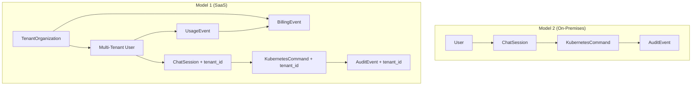
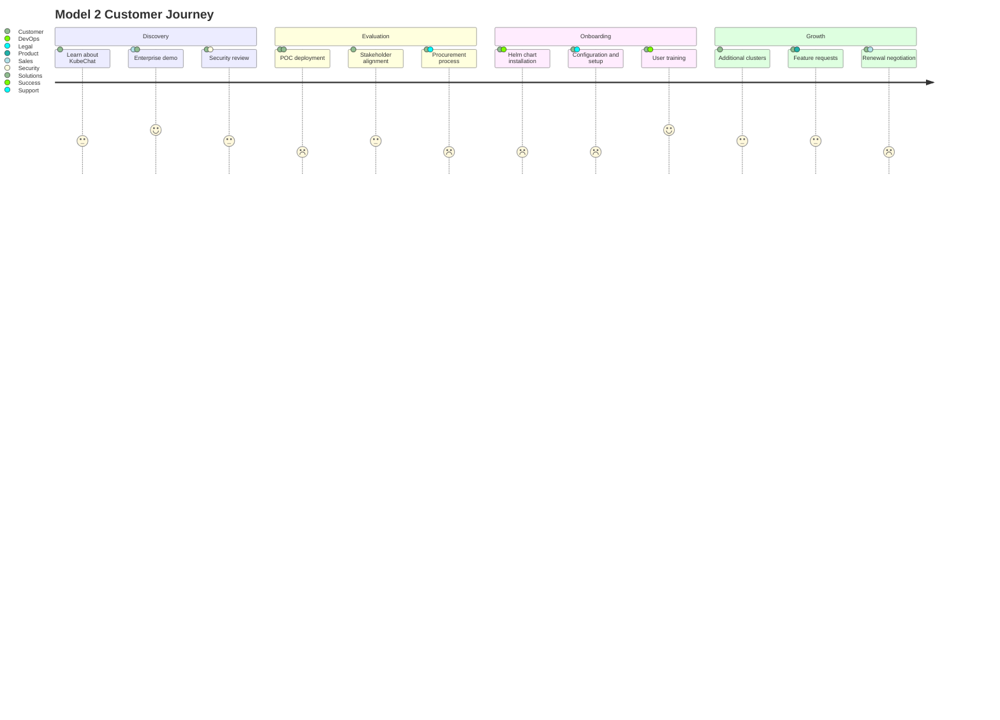
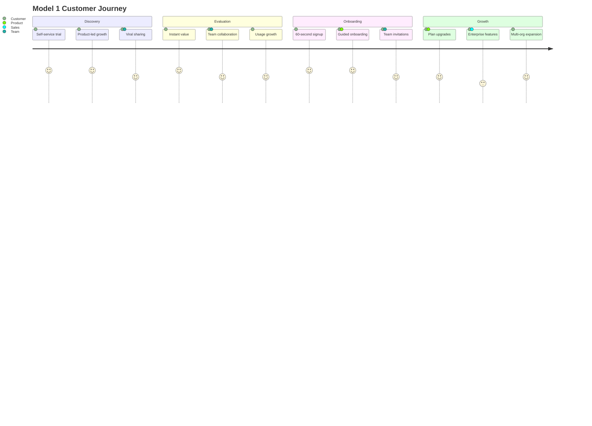

# KubeChat Model 1 vs Model 2 - Comprehensive Comparison

## Executive Summary

KubeChat offers two deployment models to serve different customer segments and business needs. Model 2 (on-premises) targets security-conscious enterprises requiring full data control, while Model 1 (SaaS) serves organizations preferring managed services with global scale.

## Strategic Positioning

| Aspect | Model 1 (SaaS) | Model 2 (On-Premises) |
|--------|----------------|------------------------|
| **Target Market** | SMBs, Scale-ups, Cloud-first enterprises | Fortune 500, Regulated industries, Security-first |
| **Go-to-Market** | PLG + Inside sales | Enterprise sales + Channel partners |
| **Revenue Model** | Subscription ($50-500/user/month) | License + Support ($50K-500K+ annually) |
| **Competitive Advantage** | Speed-to-value, AI insights, global scale | Data sovereignty, security, customization |

## Technical Architecture Comparison

### Infrastructure and Deployment

| Component | Model 1 (SaaS) | Model 2 (On-Premises) |
|-----------|----------------|------------------------|
| **Deployment Target** | AWS EKS multi-region | Customer Kubernetes clusters |
| **Installation** | Instant signup, no install | Helm chart deployment |
| **Updates** | Automatic, zero-downtime | Customer-managed via Helm |
| **Scaling** | Auto-scaling, managed by us | Customer-configured HPA |
| **High Availability** | Multi-region, 99.9% SLA | Customer responsibility |
| **Disaster Recovery** | Cross-region replication | Customer backup strategy |
| **Security** | SOC 2, shared responsibility | Customer-controlled, air-gapped capable |

### Technology Stack Differences

| Layer | Model 1 (SaaS) | Model 2 (On-Premises) | Code Reuse |
|-------|----------------|------------------------|------------|
| **Frontend** | React + Tenant switcher | React (unchanged) | 95% |
| **API Gateway** | Go + Tenant routing | Go (unchanged) | 90% |
| **NLP Service** | Go + Usage tracking | Go (unchanged) | 95% |
| **Audit Service** | Go + Multi-tenant RLS | Go (unchanged) | 90% |
| **Operator** | Go + Namespace isolation | Go (unchanged) | 98% |
| **Database** | AWS RDS Aurora Global | PostgreSQL via CloudNativePG | 80% |
| **Cache** | AWS ElastiCache Global | Redis via Redis Operator | 85% |
| **Auth** | AWS Cognito + Enterprise SSO | Dex OIDC | 70% |
| **Monitoring** | CloudWatch + Datadog | Prometheus Stack | 60% |
| **Storage** | AWS EBS/S3 | Longhorn | 0% (different) |

### Data Models Comparison



## Feature Comparison Matrix

### Core Features

| Feature | Model 1 (SaaS) | Model 2 (On-Premises) |
|---------|----------------|------------------------|
| **Natural Language Interface** | ✅ Identical | ✅ Identical |
| **Command Safety Confirmation** | ✅ Identical | ✅ Identical |  
| **Audit Logging** | ✅ Enhanced with tenant isolation | ✅ Full audit trails |
| **RBAC Integration** | ✅ Kubernetes RBAC + tenant isolation | ✅ Customer Kubernetes RBAC |
| **WebSocket Real-time** | ✅ Identical | ✅ Identical |
| **Multi-cluster Support** | ✅ Via secure proxy | ✅ Direct cluster access |

### SaaS-Exclusive Features

| Feature | Model 1 (SaaS) | Model 2 (On-Premises) |
|---------|----------------|------------------------|
| **Multi-tenancy** | ✅ Full isolation | ❌ Single tenant |
| **Usage Analytics** | ✅ Built-in dashboards | ❌ Customer responsibility |
| **Global Performance** | ✅ Edge locations worldwide | ❌ Customer infrastructure |
| **Enterprise SSO Federation** | ✅ Centralized identity hub | ⚠️ Per-deployment setup |
| **Automated Billing** | ✅ Usage-based subscriptions | ❌ License model |
| **Customer Success Tools** | ✅ Onboarding, health scores | ❌ Not applicable |
| **AI-Powered Insights** | ✅ Cross-customer patterns | ❌ Limited to single org |
| **Instant Provisioning** | ✅ 60-second setup | ❌ Hours/days deployment |

### Enterprise Features

| Feature | Model 1 (SaaS) | Model 2 (On-Premises) |
|---------|----------------|------------------------|
| **Air-Gapped Deployment** | ❌ Internet required | ✅ Full air-gap support |
| **Data Residency Control** | ⚠️ Region selection only | ✅ Complete control |
| **Custom Security Policies** | ⚠️ Standard policies | ✅ Full customization |
| **On-Premises Integration** | ⚠️ Via proxy only | ✅ Direct integration |
| **Compliance Customization** | ⚠️ Standard frameworks | ✅ Custom compliance |
| **White-label Deployment** | ❌ KubeChat branding | ✅ Customer branding |

## Customer Journey Comparison

### Model 2 Customer Journey


### Model 1 Customer Journey


## Development and Operational Comparison

### Development Effort

| Aspect | Model 1 (SaaS) | Model 2 (On-Premises) |
|--------|----------------|------------------------|
| **Initial Development** | +6 months (after Model 2) | 12 months from scratch |
| **Code Reuse** | 85% from Model 2 | Base implementation |
| **Team Size** | +2 engineers for SaaS features | 8-10 engineers total |
| **Complexity** | High (multi-tenancy) | Medium (single tenant) |
| **Testing** | Complex (tenant isolation) | Standard integration tests |

### Operational Overhead

| Aspect | Model 1 (SaaS) | Model 2 (On-Premises) |
|--------|----------------|------------------------|
| **Infrastructure Costs** | $50K-200K/month (AWS) | $0 (customer pays) |
| **Support Complexity** | High (multi-tenant debugging) | Medium (single deployment) |
| **Security Responsibility** | Shared responsibility | Customer responsibility |
| **Compliance Audits** | Annual SOC 2, GDPR | Customer responsibility |
| **Incident Response** | 24/7 on-call team | Customer responsibility |
| **Performance Optimization** | Global optimization | Customer responsibility |

## Business Model Comparison

### Revenue Models

**Model 1 (SaaS) Pricing:**
```
Starter:    $50/user/month  - Up to 10 users, 3 clusters
Growth:     $150/user/month - Up to 50 users, 10 clusters, SSO  
Enterprise: $500/user/month - Unlimited, advanced security, SLA
```

**Model 2 (On-Premises) Pricing:**
```
SMB:        $50K/year     - Up to 100 users, standard support
Enterprise: $150K/year    - Up to 500 users, premium support
Global:     $500K+/year   - Unlimited, custom features, CSM
```

### Market Segmentation

| Segment | Model 1 Preference | Model 2 Preference |
|---------|-------------------|-------------------|
| **Startups (1-50 employees)** | 90% | 10% |
| **Scale-ups (51-500 employees)** | 70% | 30% |  
| **Mid-market (501-5000 employees)** | 40% | 60% |
| **Enterprise (5000+ employees)** | 20% | 80% |
| **Regulated Industries** | 10% | 90% |
| **Government/Defense** | 0% | 100% |

## Migration and Integration Strategy

### Customer Migration Paths

**Model 2 → Model 1 Migration:**
- Export customer data and configurations
- Automated tenant provisioning in SaaS
- Gradual cluster migration with zero downtime
- Training on new SaaS features
- **Timeline:** 2-4 weeks per customer

**Model 1 → Model 2 Migration (Uncommon):**
- Export tenant data and audit logs
- Generate Helm chart with customer configs
- Assist with on-premises deployment
- Knowledge transfer for self-management
- **Timeline:** 4-8 weeks per customer

### Hybrid Deployment Model (Future)

**Potential Hybrid Approach:**
- SaaS control plane + on-premises data plane
- Best of both worlds: managed service + data sovereignty
- Premium pricing tier for hybrid customers
- Requires additional development investment

## Recommendation Framework

### Choose Model 1 (SaaS) When:
✅ **Time-to-value** is critical (need results in days, not months)  
✅ **Global teams** requiring worldwide performance and availability  
✅ **Limited DevOps** resources for infrastructure management  
✅ **Growth stage** company with rapidly changing requirements  
✅ **Cloud-first** culture and existing SaaS tool adoption  
✅ **Standard compliance** needs (SOC 2, GDPR) are sufficient  

### Choose Model 2 (On-Premises) When:
✅ **Data sovereignty** is non-negotiable due to regulation  
✅ **Air-gapped** or highly restricted network environments  
✅ **Customization** requirements beyond SaaS platform capabilities  
✅ **Cost predictability** with large scale deployments (500+ users)  
✅ **Integration depth** with existing on-premises systems required  
✅ **Security policies** require complete infrastructure control  

## Conclusion

Both models serve distinct market needs with significant strategic value:

- **Model 2** establishes product-market fit, validates core functionality, and builds enterprise customer base
- **Model 1** scales the business globally, captures larger market segments, and provides recurring revenue growth

The 85% code reuse between models ensures efficient development investment while serving complementary customer segments. This dual-model strategy positions KubeChat to capture maximum market opportunity across the spectrum from security-first enterprises to growth-oriented scale-ups.