# KubeChat Model 1 - SaaS Architecture Document

## Introduction

This document outlines the Model 1 SaaS architecture for KubeChat, designed as a hosted multi-tenant service that customers access via web interface. This model is strategically planned as the second phase following Model 2's success, leveraging the Kubernetes-native foundation built in Model 2 with additional SaaS-specific layers for multi-tenancy, billing, and enterprise integrations.

**Key Strategic Advantage:** Model 1 reuses 80%+ of Model 2's codebase, requiring only additional SaaS layers and multi-tenancy features rather than a complete rewrite.

### Model Comparison

| Aspect | Model 1 (SaaS) | Model 2 (On-Premises) |
|--------|----------------|------------------------|
| **Deployment** | Hosted by KubeChat Inc. | Customer's Kubernetes cluster |
| **Data Location** | KubeChat's cloud infrastructure | Customer's infrastructure |
| **Multi-tenancy** | Required | Single tenant |
| **Billing** | Subscription-based | One-time license |
| **Updates** | Automatic | Customer-managed |
| **Compliance** | SOC 2, GDPR, HIPAA | Customer's responsibility |
| **Scalability** | Managed by us | Customer-managed |

### Change Log
| Date | Version | Description | Author |
|------|---------|-------------|--------|
| 2025-09-02 | 1.0 | Initial Model 1 SaaS architecture creation | Winston (Architect) |

## High Level SaaS Architecture

### Technical Summary

KubeChat Model 1 operates as a globally distributed SaaS platform deployed across multiple AWS regions using EKS clusters. The architecture extends Model 2's Kubernetes-native components with additional SaaS layers including multi-tenant data isolation, subscription management, enterprise SSO federation, and global API management. Each customer organization is logically isolated within shared infrastructure, with the ability to scale to dedicated clusters for enterprise customers requiring strict data residency or performance guarantees.

### Platform and Infrastructure Choice

**Platform:** AWS EKS Multi-Region with Global Load Balancing
**Key Services:** EKS, RDS Aurora Global, ElastiCache Global, CloudFront, Route 53, AWS Cognito, AWS Organizations
**Deployment Model:** SaaS hosted platform with global edge presence
**Infrastructure:** AWS multi-region deployment with automatic failover and disaster recovery
**Tenancy Model:** Shared clusters with logical isolation, dedicated clusters for enterprise tiers

### SaaS Architecture Diagram

```mermaid
graph TB
    subgraph "Global Infrastructure"
        subgraph "Edge Layer"
            CF[CloudFront CDN]
            R53[Route 53 DNS]
            WAF[AWS WAF]
        end
        
        subgraph "US-East-1 (Primary)"
            subgraph "Customer Access"
                ALB1[Application Load Balancer]
                APIGW1[API Gateway]
            end
            
            subgraph "SaaS Management Layer"
                TENANT1[Tenant Management Service]
                BILLING1[Billing Service]
                ADMIN1[Admin Portal]
                SSO1[Enterprise SSO Hub]
            end
            
            subgraph "KubeChat Core (EKS-1)"
                subgraph "Multi-Tenant Services"
                    GW1[API Gateway + Tenant Router]
                    NLP1[NLP Service Pool]
                    AUDIT1[Audit Service]
                    OP1[KubeChat Operator]
                end
                
                subgraph "Shared Data Layer"
                    RDS1[Aurora Global - Primary]
                    REDIS1[ElastiCache Global - Primary]
                end
            end
        end
        
        subgraph "EU-West-1 (Secondary)"
            subgraph "Customer Access"
                ALB2[Application Load Balancer]
                APIGW2[API Gateway]
            end
            
            subgraph "KubeChat Core (EKS-2)"
                GW2[API Gateway + Tenant Router]
                NLP2[NLP Service Pool]
                AUDIT2[Audit Service]
                OP2[KubeChat Operator]
                
                RDS2[Aurora Global - Replica]
                REDIS2[ElastiCache Global - Replica]
            end
        end
    end
    
    subgraph "Customer Organizations"
        ORG1[Enterprise Customer A]
        ORG2[SMB Customer B]
        ORG3[Enterprise Customer C]
        
        ORG1 --> CF
        ORG2 --> CF
        ORG3 --> CF
    end
    
    subgraph "Customer Kubernetes Clusters"
        K8S1[Customer EKS Cluster A]
        K8S2[Customer GKE Cluster B]
        K8S3[Customer AKS Cluster C]
        
        GW1 -.kubectl proxy.-> K8S1
        GW2 -.kubectl proxy.-> K8S2
        GW1 -.kubectl proxy.-> K8S3
    end
    
    CF --> ALB1
    CF --> ALB2
    R53 --> CF
    WAF --> CF
```



### Architectural Patterns

- **Multi-Tenant SaaS Pattern:** Logical tenant isolation with shared infrastructure, namespace-based separation for Kubernetes resources
- **Microservices Architecture:** Same as Model 2, extended with tenant-aware routing and data isolation
- **Global Distribution Pattern:** Multi-region deployment with data replication and edge caching for global performance
- **Federated Identity Pattern:** Enterprise SSO integration supporting SAML, OIDC, and directory services across multiple customer organizations
- **Event-Driven Multi-Tenancy:** Tenant-scoped event processing with guaranteed isolation and audit trails
- **Circuit Breaker Pattern:** Enhanced with tenant-level circuit breakers to prevent noisy neighbor issues
- **CQRS Pattern:** Extended with tenant-aware read replicas and tenant-specific data partitioning

## Enhanced Tech Stack for SaaS

### Additional SaaS Technologies

| Category | Technology | Version | Purpose | Model 2 Relationship |
|----------|------------|---------|---------|----------------------|
| **Multi-Tenancy** | Kubernetes Namespaces + RBAC | - | Tenant isolation | Extension of Model 2 RBAC |
| **Global Database** | AWS RDS Aurora Global | 15.4+ | Multi-region data replication | Replaces CloudNativePG |
| **Global Cache** | AWS ElastiCache Global | 7.2+ | Multi-region session/data caching | Replaces Redis Operator |
| **CDN & Edge** | AWS CloudFront | - | Global content delivery and edge caching | New SaaS layer |
| **DNS & Routing** | AWS Route 53 | - | Global DNS and traffic routing | New SaaS layer |
| **Identity Provider** | AWS Cognito + Enterprise SSO | - | Multi-tenant identity federation | Extension of Dex OIDC |
| **API Management** | AWS API Gateway | - | Rate limiting, authentication, monitoring | Extension of Model 2 API Gateway |
| **Container Registry** | AWS ECR | - | Private container image management | Replaces Harbor |
| **Monitoring** | AWS CloudWatch + Datadog | - | Multi-tenant observability and alerting | Extension of Prometheus |
| **Logging** | AWS CloudWatch Logs | - | Centralized tenant-aware logging | Extension of Loki |
| **Security** | AWS Security Hub + GuardDuty | - | Security monitoring and compliance | Addition to Model 2 security |
| **Backup** | AWS Backup | - | Automated multi-region backup | Replaces Velero |
| **Secrets** | AWS Secrets Manager | - | Managed secrets with automatic rotation | Replaces External Secrets Operator |
| **Load Balancing** | AWS ALB + NLB | - | Global load balancing with SSL termination | Replaces Ingress Controllers |
| **Certificate Management** | AWS Certificate Manager | - | Automatic SSL certificate management | Replaces cert-manager |
| **Message Queue** | AWS SQS + SNS | - | Tenant-aware async processing | Addition for SaaS workflows |
| **Workflow Orchestration** | AWS Step Functions | - | Complex multi-tenant workflows | New SaaS capability |
| **Data Warehouse** | AWS Redshift | - | Analytics and business intelligence | New SaaS capability |
| **Machine Learning** | AWS SageMaker | - | Enhanced NLP and customer insights | Extension of Ollama |

### Code Reuse from Model 2

**80%+ Code Reuse Strategy:**
- **Core Go Services:** API Gateway, NLP Service, Audit Service, Operator → Add tenant context middleware
- **React Frontend:** All UI components → Add tenant branding and multi-org switching  
- **Data Models:** All TypeScript/Go interfaces → Add tenant_id fields
- **Kubernetes Controllers:** All CRDs and controllers → Add namespace-scoped operations
- **Business Logic:** All command processing, safety validation → Unchanged
- **Authentication:** Extend Dex integration → Add Cognito federation layer

## SaaS-Specific Data Models

### Tenant Organization

**Purpose:** Represents customer organizations with subscription, billing, and configuration data for multi-tenant SaaS operations.

**Key Attributes:**
- id: string - Unique tenant identifier for all data isolation
- name: string - Organization display name  
- domain: string - Customer domain for SSO integration
- subscription: Subscription - Billing tier and usage limits
- settings: TenantSettings - Organization-wide configuration
- ssoConfig: SSOConfiguration - Enterprise identity provider integration
- createdAt: Date - Tenant onboarding timestamp

#### TypeScript Interface
```typescript
interface TenantOrganization {
  id: string;
  name: string;
  domain: string;
  slug: string;
  subscription: Subscription;
  settings: TenantSettings;
  ssoConfig: SSOConfiguration;
  billing: BillingInformation;
  usage: UsageMetrics;
  status: TenantStatus;
  createdAt: Date;
  updatedAt: Date;
}

enum TenantStatus {
  ACTIVE = 'active',
  SUSPENDED = 'suspended', 
  TRIAL = 'trial',
  CHURNED = 'churned'
}

interface Subscription {
  plan: SubscriptionPlan;
  limits: UsageLimits;
  billingCycle: BillingCycle;
  nextBillingDate: Date;
  mrr: number; // Monthly recurring revenue
}

interface UsageLimits {
  maxUsers: number;
  maxClusters: number;
  maxCommandsPerMonth: number;
  maxAuditRetentionDays: number;
}
```

### Multi-Tenant User

**Purpose:** Extends Model 2 User with tenant association, cross-tenant access, and SaaS-specific features.

```typescript
interface SaaSUser extends User {
  tenantId: string;
  tenantRole: TenantRole;
  crossTenantAccess: CrossTenantAccess[];
  lastTenantSwitch: Date;
  onboardingCompleted: boolean;
  featureFlags: FeatureFlags;
}

enum TenantRole {
  TENANT_ADMIN = 'tenant_admin',
  TENANT_USER = 'tenant_user',
  TENANT_VIEWER = 'tenant_viewer'
}

interface CrossTenantAccess {
  tenantId: string;
  role: TenantRole;
  grantedAt: Date;
  grantedBy: string;
}
```

### SaaS Billing & Usage

**Purpose:** Tracks usage metrics, billing events, and subscription management for SaaS revenue operations.

```typescript
interface UsageEvent {
  id: string;
  tenantId: string;
  userId: string;
  eventType: UsageEventType;
  quantity: number;
  timestamp: Date;
  metadata: Record<string, any>;
}

enum UsageEventType {
  COMMAND_EXECUTED = 'command_executed',
  USER_SESSION = 'user_session',
  API_REQUEST = 'api_request',
  AUDIT_EXPORT = 'audit_export',
  CLUSTER_CONNECTED = 'cluster_connected'
}

interface BillingEvent {
  id: string;
  tenantId: string;
  amount: number;
  currency: string;
  description: string;
  invoiceId?: string;
  status: BillingStatus;
  createdAt: Date;
}
```

## SaaS-Specific Components

### Tenant Management Service

**Responsibility:** Multi-tenant lifecycle management including onboarding, configuration, billing integration, and tenant isolation enforcement.

**Key Interfaces:**
- POST /tenants - Tenant provisioning and onboarding workflow
- PUT /tenants/{id}/settings - Tenant configuration management
- GET /tenants/{id}/usage - Real-time usage metrics and billing data
- POST /tenants/{id}/sso - Enterprise SSO configuration
- DELETE /tenants/{id} - Tenant offboarding and data purging

**Dependencies:** AWS Cognito for identity pools, RDS for tenant metadata, Kubernetes API for namespace management

**Technology Stack:** Go microservice with AWS SDK integration, deployed as EKS service with auto-scaling, integrated with Stripe/AWS Marketplace for billing

### Multi-Tenant API Gateway

**Responsibility:** Extends Model 2 API Gateway with tenant context injection, cross-tenant isolation, usage tracking, and SaaS-specific routing.

**Key Enhancements:**
- Tenant identification from JWT tokens and custom headers
- Request/response middleware for tenant context injection
- Usage metering and rate limiting per subscription tier
- Cross-tenant data access prevention and audit logging
- Geographic routing for data residency compliance

**Code Reuse:** 90% of Model 2 API Gateway + tenant middleware layer

### Enterprise SSO Federation Hub

**Responsibility:** Centralized identity federation supporting multiple enterprise identity providers per tenant organization.

**Key Interfaces:**
- SAML 2.0 endpoints for enterprise identity providers
- OIDC integration with Azure AD, Okta, Auth0, Google Workspace
- SCIM 2.0 for automated user provisioning and deprovisioning
- Just-in-Time (JIT) provisioning for new user onboarding

**Dependencies:** AWS Cognito User Pools, tenant-specific identity provider configurations

### SaaS Billing & Usage Service

**Responsibility:** Usage metering, subscription management, billing integration, and revenue operations for SaaS business model.

**Key Interfaces:**
- POST /usage/events - Usage event ingestion and aggregation
- GET /billing/{tenant}/invoice - Invoice generation and retrieval
- POST /subscriptions/{tenant}/upgrade - Subscription tier management
- GET /analytics/mrr - Monthly recurring revenue analytics

**Dependencies:** Stripe API, AWS Marketplace, usage aggregation database, tenant metadata service

### Global Cluster Proxy Service

**Responsibility:** Secure proxy service enabling SaaS platform to execute kubectl commands in customer Kubernetes clusters across clouds and regions.

**Key Interfaces:**
- WebSocket tunnels for persistent cluster connections
- kubectl command validation and execution with RBAC enforcement
- Multi-cluster federation for customers with multiple environments
- Secure credential management and rotation for cluster access

**Security Model:**
- Customer-controlled service account tokens with limited RBAC permissions
- mTLS authentication for all cluster communications
- Network-level isolation and encrypted tunnels
- Audit logging for all cluster interactions

## SaaS Deployment Architecture

### Multi-Region Deployment Strategy

**Primary Regions:**
- **us-east-1 (N. Virginia):** Primary region for North American customers
- **eu-west-1 (Ireland):** European customers and GDPR compliance
- **ap-southeast-1 (Singapore):** Asia-Pacific customers

**Global Services:**
- **CloudFront CDN:** Global edge locations for frontend assets and API caching  
- **Route 53:** Global DNS with health checks and automatic failover
- **Aurora Global Database:** Cross-region replication with <1s RPO
- **ElastiCache Global Datastore:** Redis replication across regions

**High Availability Strategy:**
```yaml
# Example Terraform for multi-region EKS
regions:
  primary: us-east-1
  secondary: eu-west-1
  tertiary: ap-southeast-1

eks_clusters:
  - name: kubechat-prod-use1
    region: us-east-1
    node_groups:
      - name: system
        instance_types: [m5.large, m5.xlarge]
        min_size: 3
        max_size: 20
      - name: workloads  
        instance_types: [c5.2xlarge, c5.4xlarge]
        min_size: 5
        max_size: 100

global_database:
  engine: aurora-postgresql
  global_cluster_id: kubechat-global
  primary_region: us-east-1
  secondary_regions: [eu-west-1, ap-southeast-1]
  backup_retention: 35
  encryption: true
```

### Tenant Isolation Strategy

**Namespace-Based Isolation:**
```yaml
# Each tenant gets dedicated namespace
apiVersion: v1
kind: Namespace
metadata:
  name: tenant-${tenant_id}
  labels:
    kubechat.io/tenant: ${tenant_id}
    kubechat.io/plan: ${subscription_plan}

---
# RBAC ensures strict tenant isolation
apiVersion: rbac.authorization.k8s.io/v1
kind: Role
metadata:
  namespace: tenant-${tenant_id}
  name: tenant-operator
rules:
- apiGroups: ["kubechat.io"]
  resources: ["*"]
  verbs: ["*"]
- apiGroups: [""]
  resources: ["configmaps", "secrets"]
  verbs: ["get", "list", "create", "update", "patch"]
```

**Database Isolation:**
```sql
-- Row-level security for all tables
CREATE POLICY tenant_isolation ON users
  FOR ALL TO kubechat_app
  USING (tenant_id = current_setting('app.current_tenant'));

-- Connection pooling with tenant context
-- Uses PgBouncer with tenant-aware connection routing
```

## Migration Strategy from Model 2

### Phase 1: SaaS Foundation (Months 1-2)
**Goal:** Add SaaS layers to existing Model 2 codebase
- Add tenant context to all Go services (middleware approach)
- Implement multi-tenant database schemas with RLS
- Deploy AWS infrastructure (EKS, RDS, ElastiCache)
- Create tenant onboarding and billing integration

**Code Changes:**
```go
// Example: Adding tenant context to existing Model 2 service
type TenantAwareService struct {
    *model2.OriginalService
    tenantManager *tenant.Manager
}

func (s *TenantAwareService) ProcessCommand(ctx context.Context, req *ProcessCommandRequest) error {
    tenantID := tenant.FromContext(ctx)
    
    // Add tenant validation
    if err := s.tenantManager.ValidateAccess(tenantID, req.UserID); err != nil {
        return err
    }
    
    // Call original Model 2 logic with tenant context
    return s.OriginalService.ProcessCommand(tenant.WithID(ctx, tenantID), req)
}
```

### Phase 2: Multi-Region Rollout (Months 3-4)
**Goal:** Global infrastructure and enterprise features
- Deploy secondary regions with Aurora Global Database
- Implement enterprise SSO federation
- Add advanced usage analytics and billing tiers
- Customer migration tooling from Model 2 to Model 1

### Phase 3: Advanced SaaS Features (Months 5-6)  
**Goal:** Competitive differentiation and enterprise readiness
- AI-powered insights and usage recommendations
- Advanced compliance reporting and data residency
- Partner ecosystem and marketplace integrations
- Self-service customer portal and admin tools

**Minimal Code Duplication:**
- **Shared Core:** 85% of business logic remains unchanged from Model 2
- **SaaS Extensions:** New services for billing, tenant management, SSO
- **UI Enhancements:** Tenant switching, billing portal, usage dashboards
- **Infrastructure:** Cloud-native AWS services replace Kubernetes operators

## SaaS Project Structure

```
kubechat-saas/
├── .github/
│   └── workflows/
│       ├── deploy-production.yaml    # Multi-region deployment
│       ├── terraform-apply.yaml      # Infrastructure as code
│       └── security-scan.yaml        # Container and dependency scanning
├── cmd/                              # Same as Model 2 with SaaS additions
│   ├── operator/                     # Reused from Model 2
│   ├── api-gateway/                  # Extended with tenant routing
│   ├── nlp-service/                  # Reused from Model 2  
│   ├── audit-service/                # Extended with multi-tenant isolation
│   ├── tenant-service/               # New: SaaS tenant management
│   ├── billing-service/              # New: Usage tracking and billing
│   └── cluster-proxy/                # New: Customer cluster connectivity
├── pkg/                              # Shared packages from Model 2 + SaaS
│   ├── apis/                         # CRDs from Model 2 + tenant CRDs
│   ├── controllers/                  # Extended with tenant-aware controllers  
│   ├── tenancy/                      # New: Multi-tenant utilities
│   ├── billing/                      # New: Usage metering and billing logic
│   ├── federation/                   # New: Enterprise SSO integration
│   └── proxy/                        # New: Cluster proxy management
├── web/                              # Model 2 frontend + SaaS additions
│   ├── src/
│   │   ├── components/               # Reused + tenant switcher, billing UI
│   │   ├── pages/
│   │   │   ├── chat/                 # Reused from Model 2
│   │   │   ├── audit/                # Reused from Model 2  
│   │   │   ├── billing/              # New: Subscription and usage pages
│   │   │   ├── admin/                # New: Tenant admin portal
│   │   │   └── onboarding/           # New: Tenant setup workflow
│   │   ├── hooks/
│   │   │   ├── useTenant.ts          # New: Tenant context management
│   │   │   └── useBilling.ts         # New: Billing and usage hooks
│   │   └── stores/
│   │       ├── tenant.ts             # New: Multi-tenant state
│   │       └── billing.ts            # New: Billing state management
├── infrastructure/                   # Terraform for AWS multi-region
│   ├── environments/
│   │   ├── staging/                  # Single region staging
│   │   └── production/               # Multi-region production
│   ├── modules/
│   │   ├── eks/                      # EKS cluster configuration
│   │   ├── rds-global/               # Aurora Global Database
│   │   ├── elasticache-global/       # ElastiCache Global
│   │   ├── cdn/                      # CloudFront and WAF
│   │   ├── cognito/                  # Identity and federation
│   │   └── monitoring/               # CloudWatch and alerts
│   └── terraform/                    # Environment-specific configs
├── scripts/
│   ├── migration/
│   │   ├── model2-to-model1.sh       # Customer migration tooling
│   │   └── tenant-onboarding.sh      # Automated tenant setup
│   ├── billing/
│   │   ├── usage-aggregation.sql     # Usage analytics queries
│   │   └── invoice-generation.sh     # Billing workflow automation
│   └── ops/
│       ├── tenant-backup.sh          # Tenant-specific backup procedures
│       └── security-audit.sh         # Multi-tenant security validation
├── docs/
│   ├── model1-saas/                  # This directory
│   ├── migration-guide.md            # Model 2 to Model 1 migration
│   ├── tenant-onboarding.md          # Customer onboarding process
│   └── billing-integration.md        # Revenue operations documentation
└── tests/
    ├── multi-tenant/                 # Tenant isolation testing
    ├── billing/                      # Usage tracking and billing tests
    └── federation/                   # SSO integration tests
```

## Security and Compliance for SaaS

### Multi-Tenant Security Model

**Tenant Isolation:**
- Kubernetes namespace isolation with strict RBAC
- Database row-level security with tenant context
- Network policies preventing cross-tenant communication
- Encrypted tenant-specific secrets management

**Data Protection:**
- Encryption at rest with customer-managed keys (AWS KMS)
- Encryption in transit with TLS 1.3 for all communications
- Regular security scanning and penetration testing
- SOC 2 Type II compliance with annual audits

**Identity and Access:**
- Zero-trust architecture with service-to-service mTLS
- Multi-factor authentication required for all admin access
- Enterprise SSO integration with SAML 2.0 and OIDC
- Just-in-time access with automatic session expiration

### Compliance Framework

**Regulatory Standards:**
- **SOC 2 Type II:** Security, availability, processing integrity, confidentiality
- **GDPR:** Data protection for European customers with data residency
- **HIPAA:** Healthcare compliance for regulated industry customers
- **ISO 27001:** Information security management system certification

**Data Residency:**
- Customer data stored in preferred geographic region
- Cross-border data transfer controls and documentation
- Right to be forgotten with complete data purging
- Audit trails for all data access and processing

## 🌟 KubeChat Model 1 SaaS Architecture Complete!

This comprehensive SaaS architecture leverages 80%+ of Model 2's battle-tested Kubernetes-native foundation while adding essential SaaS capabilities for global scale, multi-tenancy, and enterprise integration.

### Strategic Advantages:

✅ **Accelerated Time-to-Market:** Reuse proven Model 2 components with SaaS extensions  
✅ **Global Scale:** Multi-region AWS deployment with sub-200ms global performance  
✅ **Enterprise-Ready:** Advanced SSO, compliance, and security for Fortune 500 customers  
✅ **Revenue Operations:** Usage-based billing, subscription management, and business intelligence  
✅ **Competitive Differentiation:** AI-powered insights and customer success automation  
✅ **Migration Path:** Seamless upgrade from Model 2 on-premises to Model 1 SaaS  

**Ready for Phase 2 Development** once Model 2 achieves market validation, providing a clear path to SaaS transformation with minimal engineering effort and maximum code reuse.